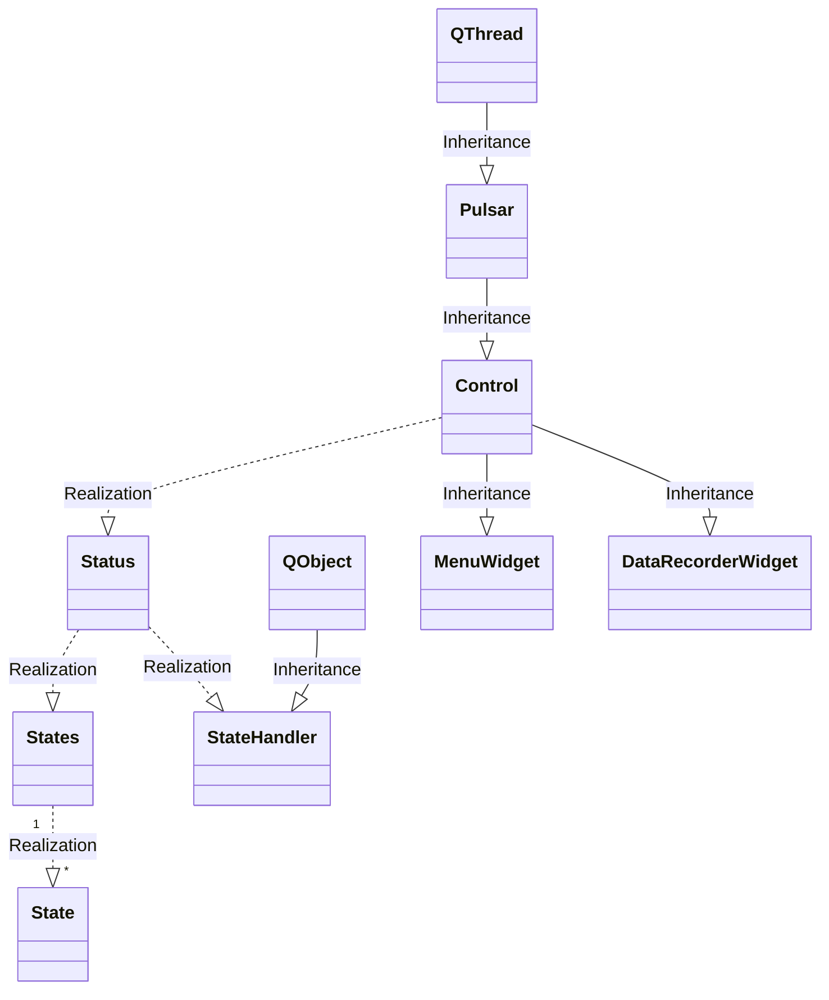

# SharedControlDrivingSim

A start to combine classes in a lego-like way to make a driving simulator. 
Inspired by mis-haptic-trainer
  
Editor: 
Visual Studio Code

notation of methods is camelCase to conform the already existing code

## Software 
* PyQt5-5.13.2 
* Python 3.8.1 64-bit 

Use PyQt5 and NOT PySide2 because PyQt5 is (more) platform independent. 

## Classes
Status() is a singleton class  
Control(Pulsar)  
StateHandler(QtCore.QObject)  
State  
States  
Pulsar(QtCore.QThread)  
DataRecorderWidget(Control)  
MenuWidget(Control)  

## Directories

### hapticsimulator (deprecated)

* haptictrainer.py (1 instance of HapticTrainer class) 
* states.py (State class, 1 instance of States class)
* statehandler.py

## process

* control.py  
holds the Control class that takes care of loading widgets   holds the singleton Status class
* statehandler.py  
handles the available states as part of the Status class
* states.py  
holds the available states as part of the Status class

## signals

* pulsar.py  
purpose is to use 2 threads, beside the main process. 
It turns out that the QTimer object are running in seperate threads but the methods (acting as 'pyqSlots') that should do something (depending on the widget), are part of the main thread. This is something to look at if this is turns out to be a problem.
1. communication with input devices (Sensodrive Steering wheel through PCAN) (as fast as possible, hopefully 1 msec)
2. spread data around to whatever module want to listen; datarecorder, plotter, GUI (200msec or so)

## widgets
## widgets.datarecorder
* datarecorder.py
reads the corresponding .ui file and does all the action needed for this widget
* datarecorder.ui
definition of the gui

## widgets.menu
* menu.py
reads the corresponding .ui file and does all the action needed for this widget
* menu.ui
definition of the gui

## widgets.interface (not used yet)
* interface.py
reads the corresponding .ui file and does all the action needed for this widget
* interface.ui
definition of the gui

## widgets.template
* template.py
Template to create other widgets, has predefined connection with the Control class
reads the corresponding .ui file and does all the action needed for this widget
* template.ui
definition of the gui

 
For now trystructure.py is an early versions of how the program might work.  
trystructure.py is using a threadpool
