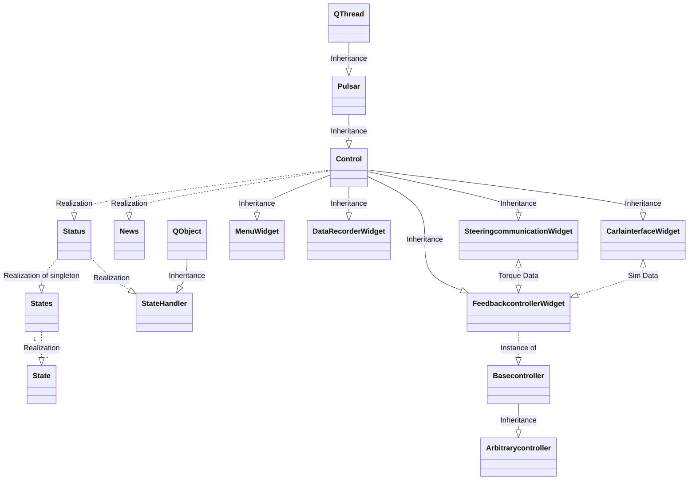

# SharedControlDrivingSim

A start to combine classes in a lego-like way to make a driving simulator. 
Inspired by mis-haptic-trainer
  
Editor: 
Visual Studio Code

notation of methods is camelCase to conform the already existing code

## Software 
* PyQt5-5.13.2 
* Python 3.8.1 64-bit 

Use PyQt5 and NOT PySide2 because PyQt5 is (more) platform independent. 

## Classes
Status is a singleton class  
New is a singleton class  
Control(Pulsar)  
StateHandler(QtCore.QObject)  
State  
States  
Pulsar(QtCore.QThread)  
DataRecorderWidget(Control)  
MenuWidget(Control)  
FeedbackcontrollerWidget(Control)  
SteeringcommunicationWidget(Control) 
Basecontroller 
Arbitrarycontroller(Basecontroller)  

## Directories

## process

* control.py  
holds the Control class that takes care of loading widgets 
holds the singleton News class 
holds the singleton Status class
* statehandler.py  
handles the available states as part of the Status class
* states.py  
holds the available states as part of the Status class

## signals

* pulsar.py  
purpose is to use 2 threads, beside the main process. 
It turns out that the QTimer object are running in seperate threads but the methods (acting as 'pyqSlots') that should do something (depending on the widget), are part of the main thread. This is something to look at if this is turns out to be a problem.
1. communication with input devices (Sensodrive Steering wheel through PCAN) (as fast as possible, hopefully 1 msec)
2. spread data around to whatever module want to listen; datarecorder, plotter, GUI (200msec or so)

## modules
### modules.datarecorder.widget.datarecorder.py
reads the corresponding .ui file and does all the action needed for this widget
### modules.datarecorder.widget.datarecorder.ui
definition of the gui
### modules.datarecorder.action.datarecorder.py
does all the action needed, like getting and writing data (not yet implemented)

### modules.menu.widget.menu.py
reads the corresponding .ui file and does all the action needed for this widget
### modules.menu.widget.menu.ui
definition of the gui

### modules.interface.widget.interface.py (not used yet)
reads the corresponding .ui file and does all the action needed for this widget
For now this widget is a 'testing' widget to see whether communication between
modules works properly
### modules.interface.widget.interface.ui
definition of the gui

### modules.template.widget.template.py
Template to create other widgets, has predefined connection with the Control class
reads the corresponding .ui file and does all the action needed for this widget
### modules.template.widget.template.ui
definition of the gui

### modules.template.widget.steeringcommunication.py
Widget that handles all communication with the sensodrive wheel, utilizes the PCANBasic
library made by PEAK-SYSTEMS. Widget also shows current state of the wheel.
### modules.template.widget.steeringcommunication.ui
definition of the gui

### modules.template.widget.feedbackcontroller.py
Widget that contains the different controllers that can be used for the car in the carsimulation,
communicates with steeringcommunication the torques that should be inputted on the wheel.
Has an empty 'Basecontroller' class of which added arbitratry controllers will inherit.
This makes sure that we always calculate the selected controller values and send these to 
steeringcommunication.

### modules.template.widget.feedbackcontroller.ui
definition of the gui

 
For now main.py is an early versions of how the program might work.  
