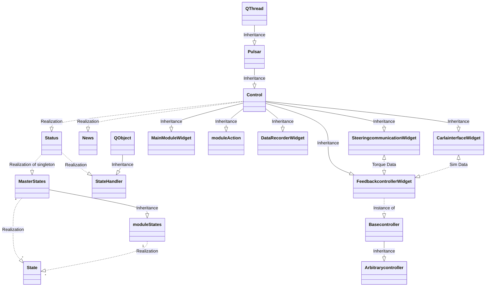
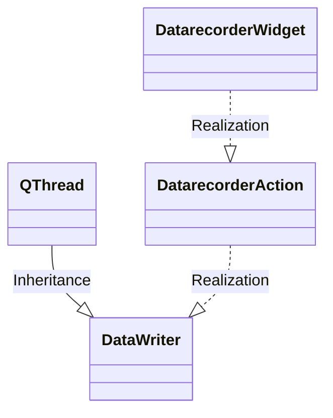

# SharedControlDrivingSim

A start to combine classes in a lego-like way to make a driving simulator.<br>
Inspired by mis-haptic-trainer
<br><br>
Editor:<br>
Visual Studio Code

notation of methods is camelCase to conform the already existing code

## Software<br>
* PyQt5-5.13.2<br>
* Python 3.8.1 64-bit<br>
* NumPy<br>

Python packages (e.g. PyQt5 and numpy) can be installed through pip3 (use pip3 to make sure you have the python3 versions!):
```
pip install pyqt5
pip install numpy
pip install qdarkgraystyle
```

Use PyQt5 and NOT PySide2 because PyQt5 is (more) platform independent.<br>

## Classes
Status is a singleton class <br>
New is a singleton class <br>
Control(Pulsar) <br>
StateHandler(QtCore.QObject) <br>
State <br>
MasterStates <br>
Pulsar(QtCore.QThread) <br>
MainModuleWidget(Control) <br>
DataRecorderWidget(Control) <br>
CarlainterfaceWidget(Control) <br>
FeedbackcontrollerWidget(Control) <br>
SteeringcommunicationWidget(Control)<br>
Basecontroller<br>
Arbitrarycontroller(Basecontroller)<br><br>
moduleWidget(Control) <br>
moduleAction(Control) <br>
moduleStates(MasterStates)<br><br>

module is something like DataRecorder
# Main class diagram



# datarecorder class diagram
Datarecorder consist of a moduleWidget called DatarecorderWidget and a moduleAction called Datarecorderaction


## Directories

## process

* control.py <br>
holds the Control class that takes care of loading widgets<br>
holds the singleton News class<br>
holds the singleton Status class
* statehandler.py <br>
handles the available states as part of the Status class
* states.py <br>
holds the class MasterStates and an __init__ method that handles the (attribute)states

## signals

* pulsar.py <br>
purpose is to use 2 threads, beside the main process.<br>
It turns out that the QTimer object are running in seperate threads but the methods (acting as 'pyqSlots') that should do something (depending on the widget), are part of the main thread. This is something to look at if this is turns out to be a problem.
1. communication with input devices (Sensodrive Steering wheel through PCAN) (as fast as possible, hopefully 1 msec)
2. spread data around to whatever module want to listen; datarecorder, plotter, GUI (200msec or so)

## modules
### modules.datarecorder.widget.datarecorder.py
reads the corresponding .ui file and does all the action needed for this widget
### modules.datarecorder.widget.datarecorder.ui
definition of the gui
### modules.datarecorder.action.datarecorder.py
does all the action to get the datarecorder initializing and working
### modules.datarecorder.action.datawriter.py
actually writes data (from News), every time a pulse calls the do-method in datarecorderWidget
### modules.datarecorder.action.datarecordersettings.py
reads and writes settings in json format which items should be recorded (default: all)

### modules.menu.widget.menu.py
reads the corresponding .ui file and does all the action needed for this widget
### modules.menu.widget.menu.ui
definition of the gui

### modules.carlainterface.widget.interface.py (not used yet)
Carla interface handles all communication between carla and unreal by making use of the 
carla PYTHONAPI. Here we have to extract all the info we want to use and can send it 
over the news channel
### modules.carlainterface.widget.interface.ui
definition of the gui

### modules.template.widget.template.py
Template to create other widgets, has predefined connection with the Control class
reads the corresponding .ui file and does all the action needed for this widget
### modules.template.widget.template.ui
definition of the gui

### modules.template.widget.steeringcommunication.py
Widget that handles all communication with the sensodrive wheel, utilizes the PCANBasic
library made by PEAK-SYSTEMS. Widget also shows current state of the wheel.
### modules.template.widget.steeringcommunication.ui
definition of the gui

### modules.template.widget.feedbackcontroller.py
Widget that contains the different controllers that can be used for the car in the carsimulation,
communicates with steeringcommunication the torques that should be inputted on the wheel.
Has an empty 'Basecontroller' class of which added arbitratry controllers will inherit.
This makes sure that we always calculate the selected controller values and send these to 
steeringcommunication. (for now we also send the steering gain directly to sim to test)

### modules.template.widget.feedbackcontroller.ui
definition of the gui

<br>
For now main.py is an early versions of how the program might work. <br>


## mkdocs

We are using mkdocs and ReadTheDocs for our documentation. 

To install mkdocs, run:
```
pip install mkdocs
```

You can edit the index.md file to add more details about your project (add more pages, for example). The CARLA readthedocs is a nice example. See their `docs` folder and `mkdocs.yml` on their [CARLA GitHub](https://github.com/carla-simulator/carla).

You can build your documentation _locally_ through:

```
mkdocs serve
```

This command builds your Markdown files into HTML and starts a development server to browse your documentation. Open up [http://127.0.0.1:8000/](http://127.0.0.1:8000/) in your web browser to see your documentation. You can make changes to your Markdown files and your docs will automatically rebuild. 

We will also link the documentation to [ReadTheDocs.org](https://readthedocs.org), which provides an online platform for this documentation. More on this will follow soon.

## Git flow

We try to use the Git flow workflow in terms of branching, feature implementation and testing and releases. For more information, visit this [link](https://www.atlassian.com/git/tutorials/comparing-workflows/gitflow-workflow)