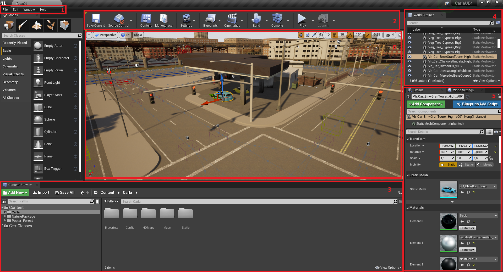

# Using the CarlaUE4 editor

We created a template map for you, and CARLA comes with a couple of maps too (check them out!). but, you probably want to create your own 

- You can create your virtual environment in CarlaUE4. The CARLA documentation has nice [tutorials](https://carla.readthedocs.io/en/latest/#tutorials-developers).
- The Unreal Editor itself also has some tutorials:
  - You can find the tutorials through `Help` &rarr; `Tutorials`
    - 'Landscape' explains how to adjust the map in height, color, and everything you need to know about the map
    - 'Foliage' has info on placing the visual objects, like trees, etc.
  - We recommend taking the 'Walkthrough'
- To create a road, you can use RoadRunner (see some instructions [here](https://carla.readthedocs.io/en/latest/tuto_A_add_map/#create-a-map-with-roadrunner))
- [This website](https://www.raywenderlich.com/771-unreal-engine-4-tutorial-for-beginners-getting-started) also provides an excellent resources for working with the Unreal Editor.

<!--
## Layout of the Unreal Editor
First of all a short overview of the different components and windows you are most likely to use:

1. __Unreal Editor Menu Bar__
2. __Level Specific Menu Bar__
3. __Content Manager__
4. __World Outliner__
5. __Details Panel of selected Object__
6. __Level View__

-->