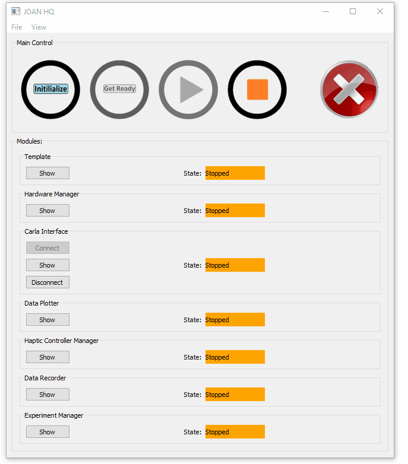
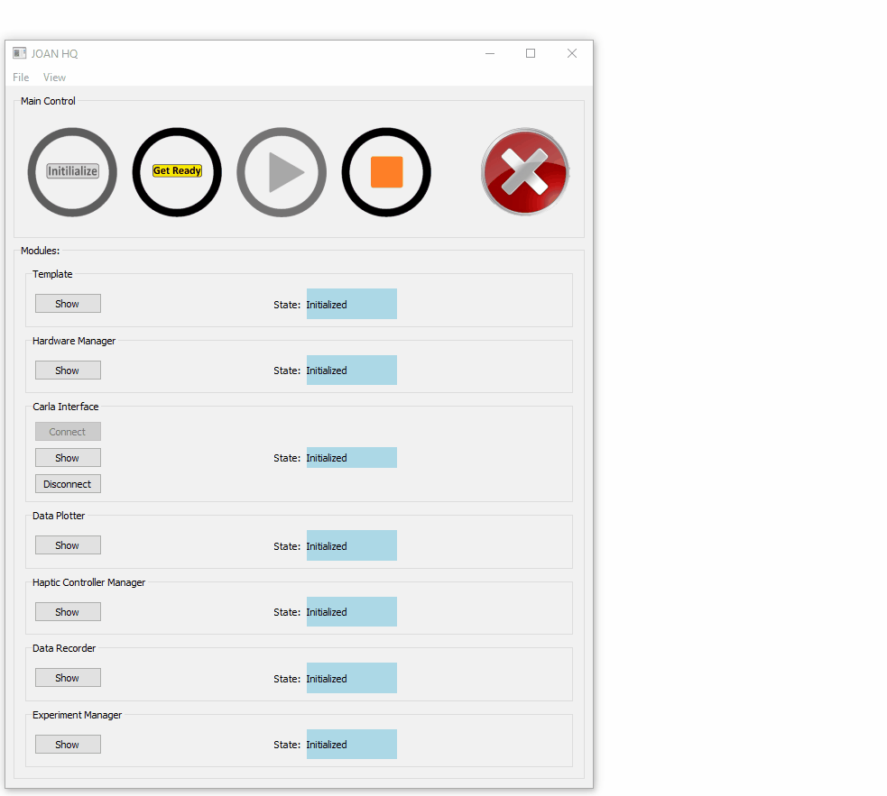
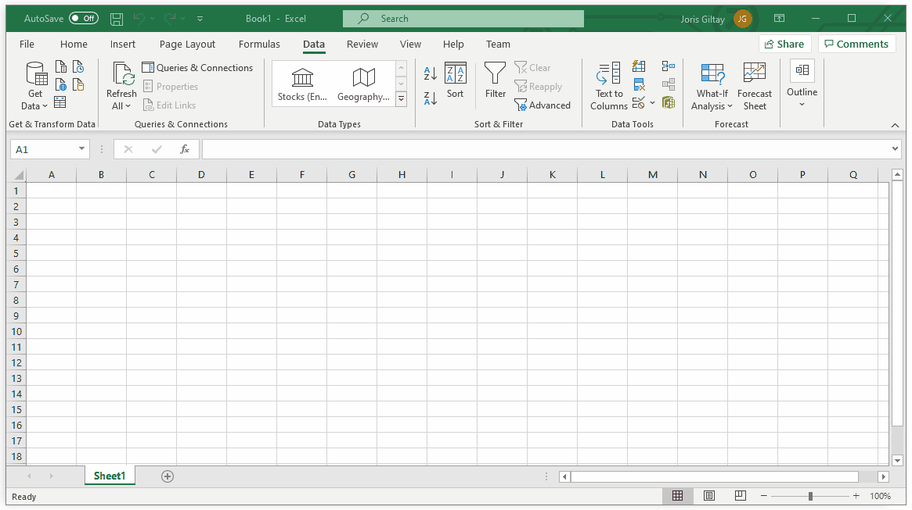

# Running JOAN and CARLA

These are the steps required from executing JOAN to driving your vehicle in CARLA. This quick guide will include a lot of 
references to more detailed documentation for the modules themselves. If you cannot seem to grasp what is going on in the GIFS
below then please look at that documentation. Other than that the text descriptions in this section will be minimal, and mostly
GIFs and pictures! :)

!!! Note
    This quick setup guide only shows the usage of 3 basic modules namely, `Hardware Manager`, `DataRecorder` and `CarlaInterface`, please refer to the 
    actual documentation of the seperate modules if you want more info on how to setup the remaining default ones.

### 1. Run JOAN and CARLA

Out-of-the-box, JOAN has a couple of modules included (`CarlaInterface, HardwareManager, DataRecorder, Haptic Controller Manager , DataPlotter and  the Experiment Manager`). These should show up in JOAN HQ, JOAN's headquarters.

- To run JOAN, either execute (in a terminal):
```
    python main.py
```
    
Make sure that your virtual environment is activated (each line should start with `(venv)`).

Or, if you use PyCharm, click the green play button or right-click on `main.py` and click on `Run main`.

- To start CARLA, open the CarlaUE4, and open your map in CarlaUE4. 

- Hit the big play button in CarlaUE4

See below the GIF for step 1 :
[  ](gifs/joan-run-firststep.gif)

### 2. Add an input device
Open up the `hardware manager` and click the `add hardware button` select your input, put in the appropriate settings and save. (For more details please
go to [using the hardware manager](modules-hardwaremanager.md#using_hw_manager).

In the example below we use a Keyboard.
[  ](gifs/joan-run-add-input.gif)

### 3. Add an agent
Open up `carlainterface` and click the `add agent` button, select your agent, apply the appropriate settings (for this example we use
a keyboard as input) and save. For more details please visit [using the Carlainterface module](modules-carlainterface.md/#using_carlainterface).
See the gif below for this step:

[  ](gifs/joan-run-add-agent.gif)

### 4. Initialize
Now that we have our basic driving setup completed its time to initialize the modules. In the example below we still have
our included module windows open, this is not necessary but included here to show that the modules change to 
the `initialized` (blue color) state accordingly. Going to that state is easily done by clicking the `initialize` button in the main JOAN window:
[  ](gifs/joan-run-initialize.gif)

!!! Note
    If any code errors are found the module will go into the error state and save a log file

### 5. Setup the variables you'd like to record and where to save them in the DataRecorder
Whenever you want to record some data you'll have to setup the DataRecorder after initializing. First we open up the DataRecorder
module dialog, then we specify our save path (where we want the `.csv` file to go) and lastly we check the variables we would like
to record:

[  ](gifs/joan-run-setup-datarecorder.gif)

### 6. Get Ready
Next step is to transition to the next state, `ready`, as you will see in the gif below this process takes
a little while because JOAN has to create and setup all the multiprocesses and will only continue if they are 
all done. This can take up to 15 seconds or so, so please be patient. You'll see the cursor also being a 
circle during this time.
If everything went well you'll notice the state change from the blue `initialized` to the yellow `ready`.
[  ](gifs/joan-run-setup-getready.gif)
### 7. Run and Drive!
Now the only thing left to do is to click `run` to go to the `running` state and start driving around:
[ ](gifs/joan-run-setup-rundrive.gif)
If you press the `stop` button, JOAN Will handle everything accordingly and properly shut down
your session. (Also destroyign any spawned objects in CARLA)

### 8. Have a look at your CSV file full of data.
Just to check whether we have really recorded something we can look at the generated CSV file:
[ ](gifs/joan-run-lookatdata.gif)


---

