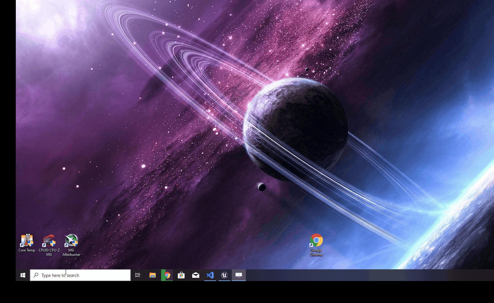

# Running JOAN

## Using PyCharm
Once you've selected the correct Python interpreter (in our case `venv`), you can run JOAN by either clicking `Run` and `Run 'main'` or right-click on `main.py` and select `Run 'main'`.

## Using any other terminal
Navigate to your repository folder. Make sure the `venv` environment is activated as your Python interpreter.

    python main.py

What should be happening is the following:

