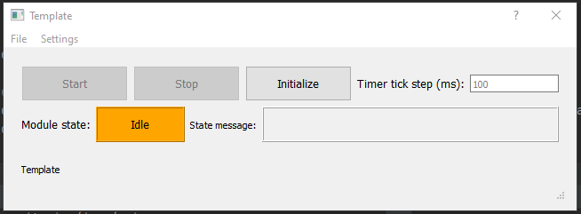
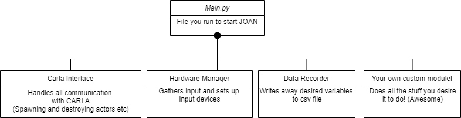

## Structure of main JOAN components

JOAN components are used in modules that you can add.

They are loaded through the Main window as they are defined in `JOANModules.py`.

Your modules, which should consist of an action- and a dialog-part inherit JOAN components to make building and using modules easier for you.

Using the `JOANModuleAction` let your module work with:

- `Status`, containing the State and the StateMachine
- `News`, your module may write to it's own news-channel using a time interval
- `Settings`, containing settings in json format
- `performance monitor` (optional) on the current module

Using the `JOANModuleDialog` gives your module a base dialog window with buttons (see picture below):

- `Start`
- `Stop`
- `Initialize`

And a menu bar with the options:

- `File`
- `Settings`

It also has an input field for setting a timer interval used when writing news (= latest data).

## Main Components of JOAN
This schematic shows the overall structure of JOAN as it is at the moment of writing (11/08/2020):

!!! Note
    JOAN will work with only 1 module as well or as many as you like. The structure shown here is a 'barebones' version of driving
    a car around and recording some data. 
    

As shown in the figure the main modules you'll probably always use are 'carlainterface', 'hardwaremanager' and the 'datarecorder'. 
These module titles sort of giveaway what they do however I will also attempt to give a short explanation of each of these modules, why they are there
and what they accomplish. 

!!! Note
    This explanation will only scratch the surface of how exactly these modules work, we have tried to document the code itself really well
    so if you want to know the knitty gritty of what exactly happens in the modules please have a look at the individual code and especially
    the docstrings/comments! :)
   
1. __Carla Interface__
This module basically acts as the bridge between python and the CARLA environment in unreal. Almost all of the communication between carla and JOAN
is done here. In this module the documentation of the pythonAPI of carla is crucial to understand and get a grasp of, you can find it [here](https://carla.readthedocs.io/en/latest/python_api/).
Examples of what can be done in this module are:

- `Spawn and destroy 'actors' (cars, pedestrians etc)`
- `Retrieve waypoints of the loaded map`
- `Change a vehicle's physics characteristics`
- `Any functionality you can find in the CARLA pythonAPI`[link](https://carla.readthedocs.io/en/latest/python_api/)

!!! Important
    A good understanding of python is needed to grasp the functionality that can be implemented. It is therefore strongly recommended to take a good look
    at the documentation before you try and play with the module.
    
2. __Hardware Manager__ 
This module is quite self explanatory, it deals with any sort of input you wish to use with JOAN. The standard inputs that it can handle are
- `Keyboard`
- `Any sort of HID (human interface device) joystick`
- `SensoDrive` This will be the input you use if you want to do anything with forces on the steeringwheel

The hardware manager is build up in such a way that you will be able to add your own inputs if they inherit from the 'baseinput' class

3. __Data Recorder__
This module is also self explanatory, when initializing the module the current items that are in the news channel will be shown in the
window. You can check and uncheck the variables you'd wish to save, it will then save these variables in a csv file.

