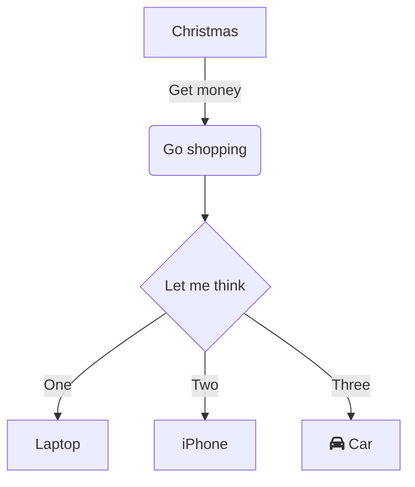

## Structure of main JOAN components

JOAN components are used in modules that you can add.

They are loaded through the Main window as they are defined in `JOANModules.py`.

Your modules, which should consist of an action- and a dialog-part inherit JOAN components to make building and using modules easier for you.

Using the `JOANModuleAction` let your module work with:

- `Status`, containing the State and the StateMachine
- `News`, your module may write to it's own news-channel using a time interval
- `Settings`, containing settings in json format
- performance monitor (optional) on the current module

Using the `JOANModuleDialog` gives your module a base dialog window with buttons:

- `Start`
- `Stop`
- `Initialize`

It also has an input field for setting a timer interval used when writing news (= latest data).

## Schematic overview

