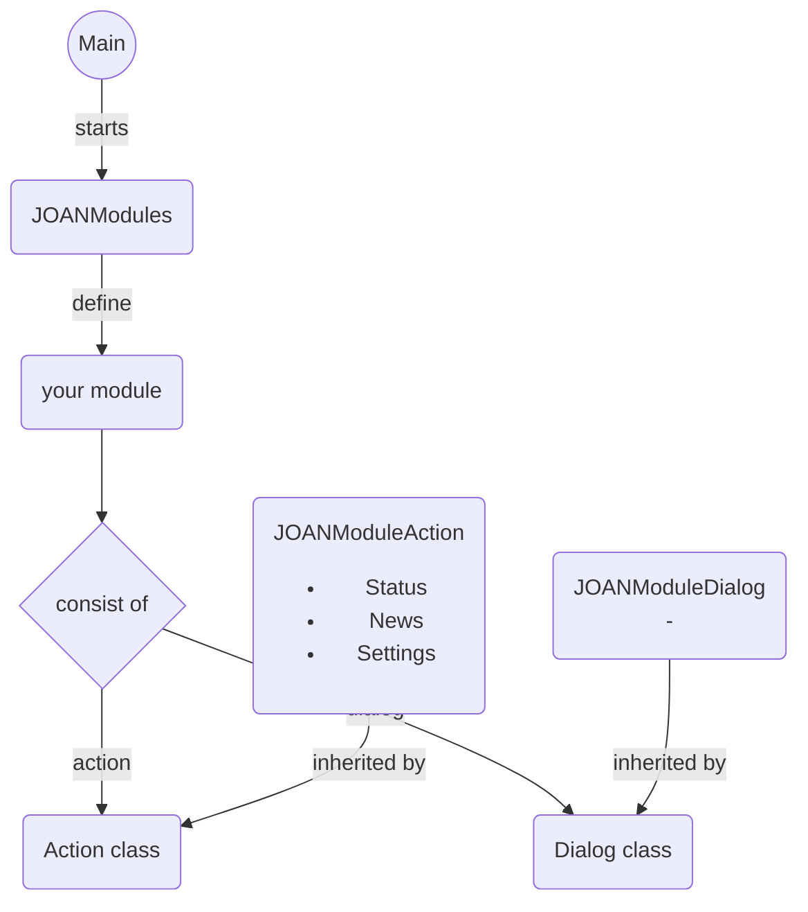

## Structure of main JOAN components

JOAN components are used in the modules that you can add.
 
They are loaded through the Main window as they are defined in JOANModules.py.
  
Your modules, which should consist of an action- and a dialog-part inherit JOAN components to make building and using modules easier for you.
 
Using the JOANModuleAction let your module work with:
<ul>
<li>Status, containing the State and the StateMachine</li>
<li>News, containing data that is written by a module at each time interval</li>
<li>Settings, containing settings in json format</li>
<li>performance monitor (optional) on the current module</li>
</ul>

Using the JOANModuleDialog gives your module a base dialog window with three buttons:
start, stop and initialize as well as an input field for setting a timer interval, for writing news (=data).

