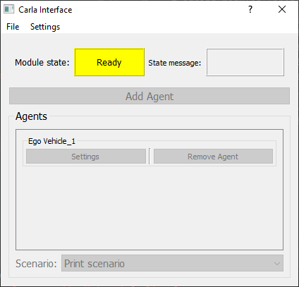
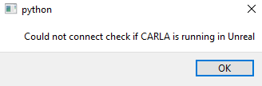
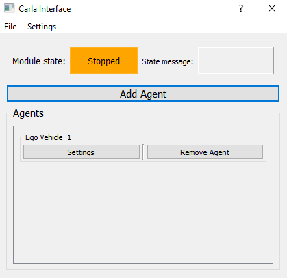
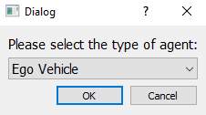
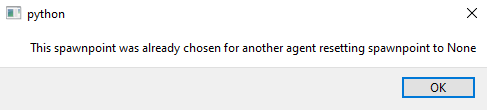
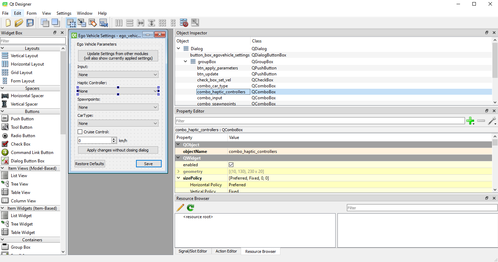

# Module: CARLA Interface

Depending on whether you want to use the CARLA simulation environment with JOAN, the CARLA interface module is one of the core modules. If you want to do
anything with CARLA it is advised to use this module. An example screenshot of the module dialog layout in the `READY` state is shown below:

In this section we'll cover 3 main things namely: `using the module`, `creating your own agent to add` and `creating a scenario`.

## Using the Module

### Carla Connection

Whenever you have included CarlaInterface in your modules, JOAN will try to connect to CARLA at start up. If this process fails you will see the following
dialog:

This could happen if you did not start up CARLA in Unreal yet or there are some other connection issues. If connection failed at startup this is not a problem,
via the main JOAN window you can still connect to CARLA by pressing the connect button, shown below:

If JOAN is already connected the connect button will not be available but the disconnect button is enabled. One last thing remains to be said about the CARLA
connection. Due to the fact that we use multiprocessing we need to connect to CARLA again when the module process is created (this is done after
clicking `get ready`). This makes sure we have acces to our CARLA pythonapi function within this process. There is however a big note to this:

!!! Important Whenever you are already in the `READY` state, and you stop CARLA from the unreal side, this will lead to erratic behaviour in JOAN. So never stop
your experiments via the quit button in Unreal. Ideally you use the 'play' button in unreal once before starting up JOAN and stop it again after you quit JOAN.

### Adding Agents

As with most modules it is only possible to add, remove or change settings in the `STOPPED` state:

So whenever pressing the `add agent` button a dialog will pop-up prompting you to choose what sort of agent you'd like to add. In the default JOAN only 1 agent
is available, namely an `Ego Vehicle`.

Clicking `OK` wil open the settings of this particular Ego Vehicle.

As can be seen in the image above we need to set some settings before we can actually do anything with the ego vehicle. The options for input/and haptic
controller will only be available if these have been added in that particular module. If the other options are not showing but you did add them in the
appropriate module, try and click the update button at the top, this will update the groupboxes. `Spawnpoints` and `CarType` are directly communicated from
CARLA, therefore if you have no connection to CARLA these will be empty (another hint that you should connect to CARLA first). If you add 2 vehicles and they
have the same spawnpoint an message will pop-up saying that there is a spawnpoint conflict and the spawnpoint will reset to `None`:

!!! Note If you choose None for spawnpoint it will just not spawn any car, same goes for the CarType.

The last thing you can choose from is cruise control checkbox and a desired speed. Please note that this will use a PD controller on the throttle and brake and
does not set the velocity instantly.

### selecting a scenario

The drop-down box in the lowest part of the carla interface dialog lets you select a scenario. Scenarios are meant to contain simple rule based triggers to
trigger events in the world under specific conditions. An example could be to spawn another vehicle on a cross-section when the ego-vehicle approaches this
cross-section. One example scenario is included in JOAN: the print scenario. This scenario will print a message if a keyboard is used as a hardware input. It
serves no purpose other than showcasing what can be done with a scenario. To learn how to add your own scenarios to JOAN, please read
the `Add your own scenario`
section below.

## Adding Your Own Agents

This section will describe, how you can go about to implement your own agent, so adding an agent other than `Ego Vehicle`. There are some things you need to
keep in mind while doing this so therefore this section will go a bit more into detail. The steps below do not have to be followed in this particular order,
however it might be easy to just follow them in this order anyway.

### Step 1. Getting informed

Check out the file

    .../modules/carlainterface/carlainterface_agenttypes.py

This will be your main reference as to which files you'll need to create and where. The `carlainterface_agenttypes.py` file contains an Enum class, which points
to all the locations and needed files. You'll notice that the `EGO_VEHICLE` has the following 7 elements to it:

1. `process` class
2. `settings dialog` class
3. `settings` class
4. `shared_variables` object
5. `settings_ui_file`
6. `agent_tab_ui_file`
7. `__str__` representation

### Step 2. Adding/copying the classes.

We would highly like to recommend by first creating your new agent_type file:

    .../modules/carlainterface/carlainterface_agentclasses/<YOUR_AGENT_TYPE_FILE>.py

Now that you have this file you need to make the same sort of structure as the `ego_vehicle.py` file. Ofcourse the exact implementation depends very heavily on
what you desire this agent to do or be. However the file should contain the following classes:

- `<YOUR_AGENT_TYPE_NAME>SettingsDialog`
- `<YOUR_AGENT_TYPE_NAME>Process`
- `<YOUR_AGENT_TYPE_NAME>Settings`

If you are a well-versed python programmer you can just look at the ego_vehicle implementation and make your own version of what you need. However if you are
not, it might be easier to (for now) copy these classes from the `ego_vehicle.py` file, make it error free and then start making your changes. Once you have
these classes implemented you have 3/7 elements you need as mentioned earlier.

### Step 3. Adding/copying the ui files.

#### SettingsDialog ui file

This step might be a bit difficult. We would recommend using some sort of UI generating program to create your dialogs (ui files). We
used [QtDesigner](https://build-system.fman.io/qt-designer-download){target="_blank"} for JOAN. Just to begin its a good idea to find the `ego_vehicle` ui
files, and open them in QtDesigner (click for enlargement):

{target="_blank"}

In QtDesigner we can add groupboxes, buttons, labels etc. Anything you need to make a proper settings dialog. In the right top corner you must name your objects
sensible names so you can easily distinguish what is what. For example if you would like to add a combobox that decides the color of the car you could add a
Combobox and name it `combobox_carcolor`.

If we have also included `carcolor` as a setting we can then in the `<YOUR_AGENT_TYPE_NAME>SettingsDialog` add something like:

    self.settings.selected_carcolor = self.combo_carcolor.currentText()

Rather than chew everything out here, we recommend you take a look at the inner workings of this in the `ego_vehicle.py` file!

#### Agent Tab ui file

Luckily this one is easier, assuming that you only want to have the buttons `settings` and `remove_agent` you can just use the standard:

    .../modules/carlainterface/carlainterface_agentclasses/ui/agent_tab.ui

However if you want more functionality in this tab you can add your ownly designed tab ofcourse!

!!! Note For reference, this has also been done for the `module_card.ui` and `module_card_carlainterface.ui`, so if you're interested please take a inside
`.../core/hq`

### Step 4. Adding/copying shared variables object

The sharedvariables object should contrain all the variables you'd like to do something with from the rest of JOAN, so if you want to record or plot anything or
just do anything with the data at all outside of its own process it should be inside the sharedvariables class.

As you might have noticed this object is not contained within your new `<YOUR_AGENT_TYPE_FILE>.py1`, so it should come from somewhere else, namely:

    `.../modules/carlainterface/carlainterface_sharedvariables.py`

You should add a class containing your desired variables `<YOUR_AGENT_TYPE_NAME>SharedVariables(SharedVariables)` here.

### Step 5. Linking it all together from the `carlainterface_agenttypes.py` enum

Now that you have all needed files its now a matter of adding them to the enum!

!!! Important Make sure you link to the correct files in the enum, take the Ego Vehicle as a reference

### Step 6. Loading from dict update

If you want to load settings from a json file for your freshly new agent there is one thing you should still do:
In the following file you should add the same lines but adjusted for your new vehicle:

    .../carlainterface/carlainterface_settings.py

In the function `load_from_dict` you will need to add:

    for identifier, settings_dict in module_settings_to_load['agents'].items():
        if str(AgentTypes.<YOUR_AGENT>) in identifier:
            <YOUR_AGENT>_settings = AgentTypes.<YOUR_AGENT>.settings()
            <YOUR_AGENT>_settings.set_from_loaded_dict(settings_dict)
            self.agents.update({identifier: <YOUR_AGENT>_settings})

### Step 7. This guide wasn't useful at all I tried copying everything and it doesn't work!? What do I do?!

It is highly likely that you forgot a crucial part, you have to be very meticulous! The error messages you get in the terminal should help you underway as to
where things went wrong!

## Add your own scenario

To add your own scenario to JOAN, the only thing you have to do is create a scenario class that inherits from the `Scenario` abstract base class, and place it
in the `module/carlainterface/scenarios/` folder. All scenario classes in this folder are automatically detected by JOAN and can be selected from the carla
interface dialog the next time you start JOAN.

Every scenario needs two components, a unique name to identify the scenario implemented as a property, and a `do_function`. The `do_function` will be called
automatically on every timestamp, in this function you can check conditions and execute actions. Please note that scenarios are implemented in the same loop as
the communications with carla, so scenarios are not meant for heavy calculations like calculating control input. A scenario should on perform simple checks and
trigger events. These triggers can be implemented as pipes, queues or signals to other modules where the heavy load is covered to make sure carla interface is
not overburdened.

The print scenario in the `scenarios` folder serves as an example of how to implement your own scenario. Please have a look at how it is implemented to get
started with your own implementation.
