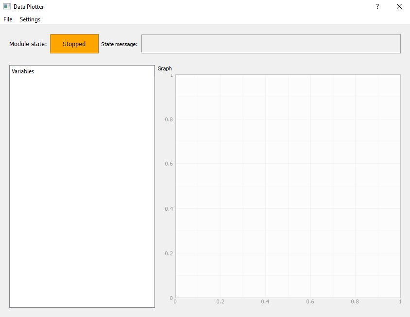
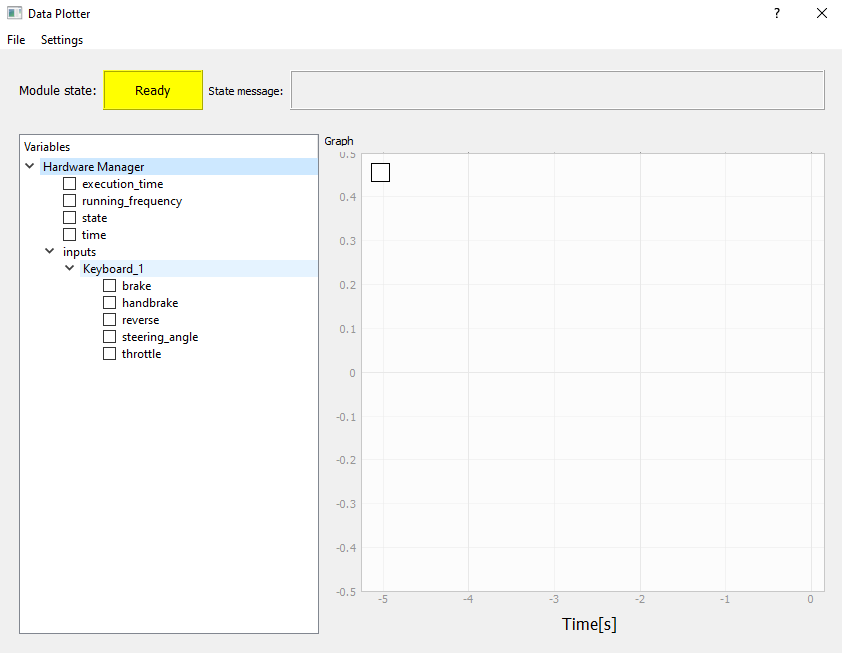
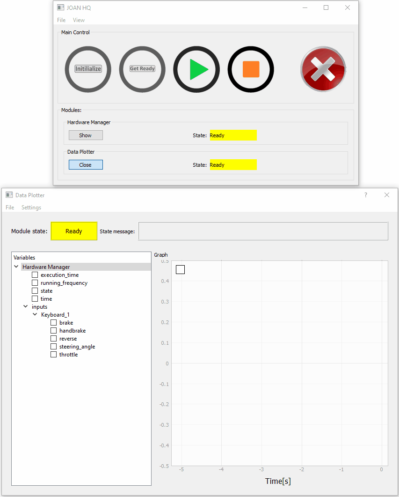

# Module: DataPlotter
The DataPlotter module is quite self explanatory, it plots your data. This is quite an important feature 
because it is almost the only way to get a bit of insight into what is going on, without having to log all data
and then plotting it after.There are some things that have to be kept in mind when using this module, but before we go
into that, below the module is shown as it should look like in the `STOPPED` state:
 

 
## Using the Module
 The main big difference of the dataplotter compared to the other modules is that it is adjustable during the `RUNNING` and `READY`
 states. This is due to the fact that the sharedvariables only become available after the rest is in `READY`. This means that we only see
 the variables we can plot after we've reached the `READY` state as shown below:
 
  
 
 In the image above we have only included a keyboard input in the `Hardware Manager`. We can also immediately see that the HardwareManager 
 is the only included module besides the dataplotter.
 
 If we now check or uncheck these items we can see what the value was over the last 5 seconds, in the graph on the right. The GIF below
 will nicely show what is happening. Also notice that the legend is updated automatically. 
 
 
 
!!! Note
    If you plot CarlaInterface variables keep in mind that the data you receive from carla is always from the last applied frame. This means that
    there will always be a bit of a delay between the data from for example the brake in hardwaramanager w.r.t. the applied input in CARLA.