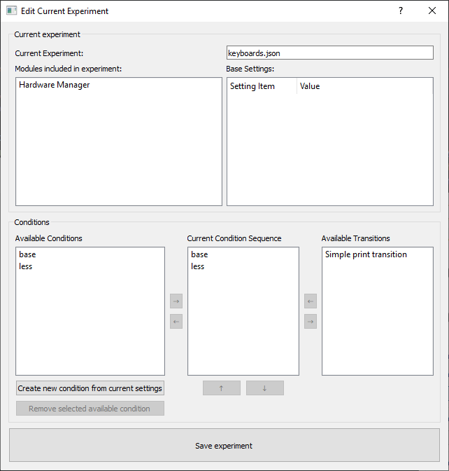

# Module: Experiment Manager

To run experiments, you need to define your conditions and run them in the order you want. To make your life a bit easier, we built an Experiment Manager module, 
in which you can:

- create or modify an experiment,
- add conditions to the experiment,
- select the conditions you actually want to run in your experiment,
- set the order of the conditions, and
- customize each transition between conditions (such as respawning cars and traffic)

The Experiment Manager has two main components: __conditions__ and __transitions__. We will describe how to use them below.

---

## How does the Experiment Manager work?

The Experiment Manager stores and sets the [settings of all modules](advancedsteps-settings.md) that are relevant for your experiment. Each modules has its own 
settings. For example, the settings of the steering wheel controller module contain the current values of the controller gains. 

When running and experiment, per condition, you want to change these settings. The Experiment Manager checks the current settings of the controller module and 
sets the value that corresponds to the condition you want to activate and run next in your experiment. The opposite happens when you are defining your 
experiment: you change the settings of each module that you want to change for each condition. The Experiment Manager recognized which settings you changed and 
stores these changes. 

An `Experiment` consists of a set of base settings, and every `Condition` stores the changes that have to be made to these base settings for that specific 
condition.  

The experiments are stored in a `json` file, which you can open in any text editor to check whether your experiment and conditions are to your liking. You can 
also alter these files to make changes to your experiment. 

In contrary to all other modules, the Experiment manager has no state machine and own process. This is because the Experiment Manager does not run anything, it
merely sets all setting for you to streamline your experiment.  

---

## How do I use the Experiment Manager?
### 1. Creating a new experiment

Creating and editing experiments can only be done if all modules are in the initialized state. This is because in that state all module settings are fixed. So
to create a new experiment, first set all modules to the settings you want to be the base settings of your experiment. Now click initialize in the JOAN main 
window, after which the `Create Experiment` button in the Experiment manager becomes available. With this button you can create your new experiment. You have 
to specify which modules to include in your experiment. Modules that are excluded will work but are not affected by the experiment manager. So you have to set
their settings manually. Finally you need to specify a name and save path for the `*.json` file.

### 2. Creating conditions
Now that you have your experiment, you'll need conditions. This works in the same way as creating the experiment. So the first step is to move all modules back 
to the stopped state by clicking the stop button. Now alter the settings of the modules such that the represent your condition. Finally click the initialize 
button again to fix these settings and click the `create new condition for current settings` button in the edit experiment dialog. Repeat this process until you
have created all conditions. Conditions can not be altered once they have been made. You can delete them and create new ones. You can view the changes wrt the 
base settings of an experiment by double clicking a condition in the edit experiment dialog. 

The only exception to this method of creating conditions is the data recorder, please see the note's on using the data recorder below.

!!! Important
    Do not forget to click the save experiment button before closing the edit experiment dialog!

### 3. Creating Transitions
Transitions are used in between conditions to execute any code you want. To create a new transition you have to create your own transition class that inherits 
from the `Transition` class. If you place it in the folder `modules\experimentmanager\transition`, it will be recognized by the experiment manager automatically
. You can have a look at the `SimplePrintTransition` class as an example, if you want to you can copy, rename and alter it and start from there. `Transition` 
classes have two implementable methods that are called before and after the new condition settings are applied.

### 4. Define the flow of your experiment
Finally you need to define the flow of your experiment, this is done in the edit experiment dialog which is shown below. An experiment consists of a sequence of
 conditions. Transitions can be added in between optionally. All conditions and transitions can be used multiple times in one experiment. The center list in the 
 lower part of the dialog shows the current experiment sequence. Add or remove conditions and transition with the buttons beside this list. Change the order by 
moving elements up and down with the buttons below.

!!! Important
    Do not forget to click the save experiment button before closing the edit experiment dialog!

### 5. Running the experiment.
To run the experiment, close the edit experiment dialog and make sure all modules are in the stopped state. You can manually select and activate a condition by 
clicking the `Activate condition` button. Once the condition is active, you can cycle the state machine like you normally would. When you click the stop button,
 the experiment manager will automatically transition the the next condition if the `Auto transition after stop` checkbox is checked. You can also manually 
transition to the next condition by clicking the `Transition to next condition` button. Transitions are called when moving between subsequent conditions. 
Transition at the end and at the beginning of the experiment are also called.

## Using the Data Recorder with the experiment manager
You can include the data recorder in your experiment to make sure the right variables are saved in every condition. Remember that the data sile name is also 
stored as a setting so it can, and should, be different for every condition. Otherwise you have to reverse engineer which file is which condition by the 
timestamps. You can either change the name of the file depending on the condition or make separate folders for every condition.

Remember that the data recorder save path is set in the stopped state, like all other settings. But the variables that are stored are selected in the 
initialized state, this is different from the other modules. So the data recorder has to be set after transitioning to initialized and before creating the new 
condition. Remember this when creating your conditions.

 

