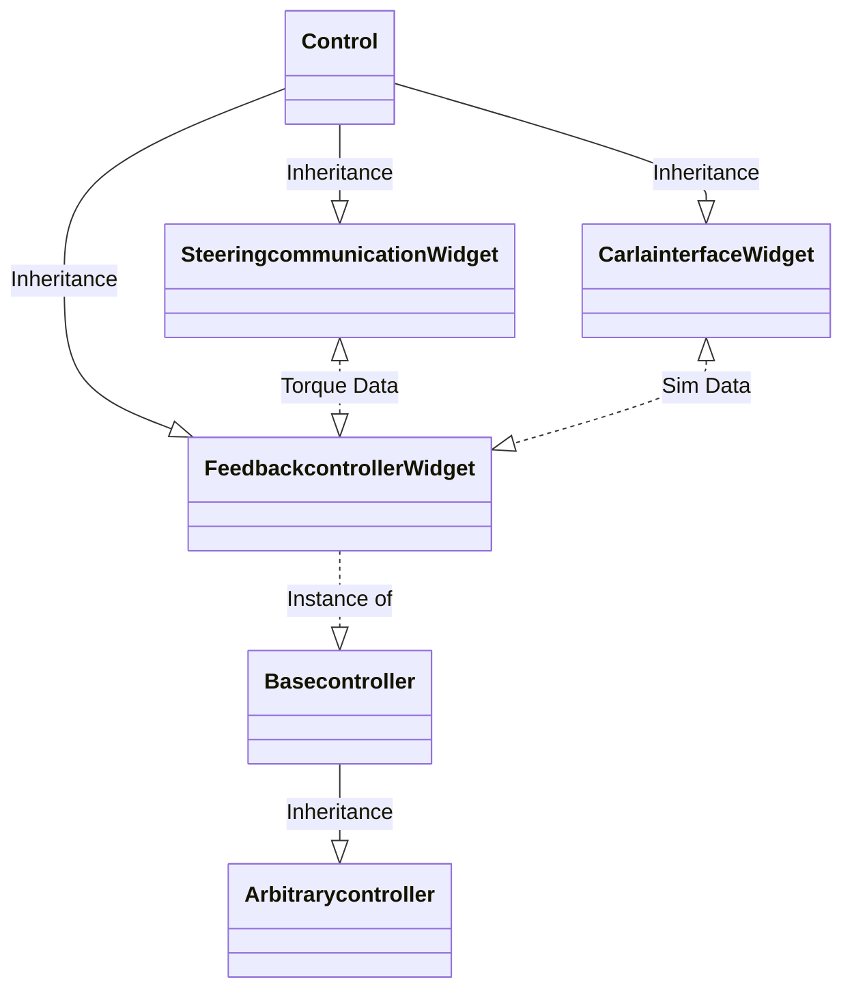

# datarecorder class diagram
Datarecorder consist of a moduleWidget called DatarecorderWidget and a moduleAction called Datarecorderaction

DataRecorderWidget(Control) 
moduleWidget(Control) 
moduleAction(Control) 
module_states(MasterStates)

# feedbackcontroller class diagram
CarlainterfaceWidget(Control) 
FeedbackcontrollerWidget(Control) 
SteeringcommunicationWidget(Control)
Basecontroller
Arbitrarycontroller(Basecontroller)

