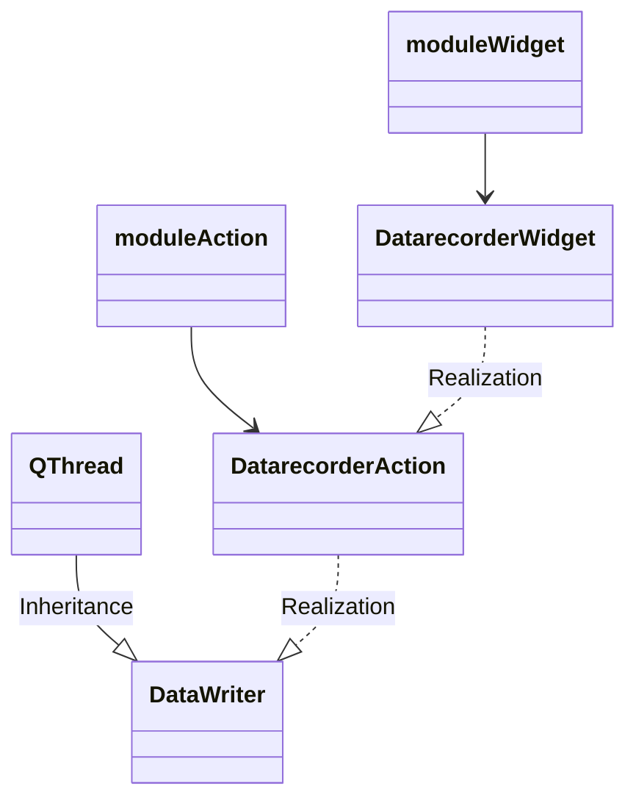

# datarecorder class diagram
Datarecorder consist of a moduleWidget called DatarecorderWidget and a moduleAction called Datarecorderaction

DataRecorderWidget(Control)  
moduleWidget(Control)  
moduleAction(Control)  
moduleStates(MasterStates)  

# feedbackcontroller class diagram
CarlainterfaceWidget(Control)  
FeedbackcontrollerWidget(Control)  
SteeringcommunicationWidget(Control) 
Basecontroller 
Arbitrarycontroller(Basecontroller)  

