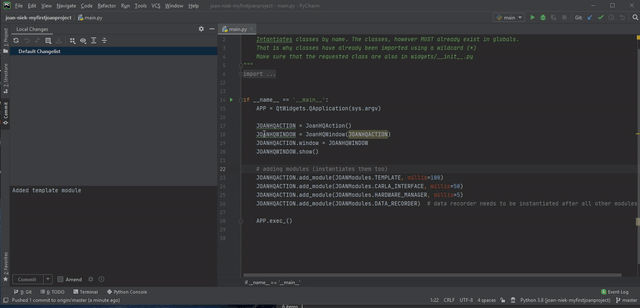
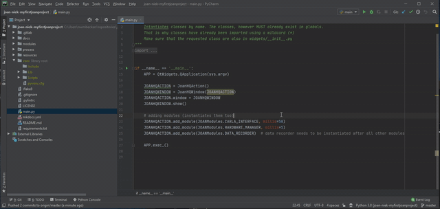

# How to GIT (source control)

## Some notes
This is a not so complete how-to for using `git` for your project. We will try to add more `git` tutorials and documentation in the near future.

`git` is a widely used versioning system for software project. It allows you to keep track of all the changes you made in your project. This is great, because when you changed something and your project crumbles before your eyes, you can easily revert to a previous version :-) Also, no more multiple .zip files with versions of your project (we are very allergic to things like receiving zipped projects like `myproject-v21-v2-evenbetterversion.zip`. Any decent programmer will not touch it, not even with a stick).

Some pros of using `git`:

- you have a history of all changes you made
- in case things go wrong, you can easily go back to a previous, working version
- it is easy to share the latest version of your code with others
- you can work on your code on multiple computers. For example, you create and test your project at home, push those changes to the online repository, and pull them on your TUDelft computer to do experiments. No more USB sticks with crappy zip files! 
- the TU provides us with a local `git` server, which is great for GDPR-reasons (not cloud-based like `github`).

However, using `git` requires a relatively steep learning curve. We will add some tutorials below. 

!!! Warning
    There are some ground rules for using our `git` servers. 

    - DO NOT UPLOAD DATA FILES TO THE REPOSITORY. Seriously, do not push big files or batches of files to the servers. Use `Surfdrive` instead for big data files. If the data file is of the greatest importance for your project, sure. DO NOT PUSH PARTICIPANT DATA TO THE GITLAB SERVER.
    - Other stuff. We'll keep you posted.

## Your first git steps

We will provide some more detailed instructions on how to use `git` with PyCharm or VS Code here in the future. 

For now, familiarize yourself with the following `git` things:

- __staging__ of files
- __committing__ files
- __pushing__ your commits
- __pulling__ latest commits from your own repository

In addition, we will provide some instructions on how to retrieve the latest changes of JOAN. 

__merge__: a slightly more advanced action in `git` is merging incoming changes to your current working version. PyCharm can help you to merge files. We are not going to give a full description on how to do this here. Google is your friend. If you really cannot figure it out, ask your supervisor.

### git tutorials and documentation

The official `git` [website](https://git-scm.com/doc) has a ton of useful information about `git` and how to use it. Scroll through the documentation section for more information and videos. However, the most important things you need to know are:

- Make your changes to the code and test if they work.
- Once you know your code works, commit the changes using git. 
- Pull any new changes in the online repository to your computer. Check if no conflicts in files exist.
- Then, push those commits (could be one or multiple commits) to the online repository

There are a lot of useful git tutorials circulating on the internet, both in written and video form. A useful video tutorial can be found [here on YouTube](https://www.youtube.com/watch?v=xAAmje1H9YM&list=PLeo1K3hjS3usJuxZZUBdjAcilgfQHkRzW). 
It explain's the use of git in 10 video's, for JOAN you can ignore the part on GitHub since we don't use GitHub. This tutorial series uses git terminal commands for all actions, this will help you understand the git basics. 
PyCharm will allow you to use the git functionality directly, see the GIF's below. 

In PyCharm, you could pull new changes in the online repo to your local copy as follows:

Here is an example on how to use PyCharm to commit and push the changes to the online repository (note, pushing and pulling can take some time, as you can see in the GIFs too):

