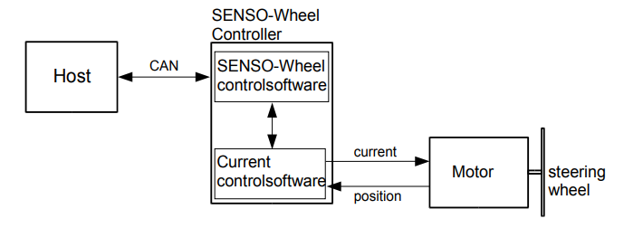

# SensoDrive Explanation
The SensoDrive is a powerful/professional actuated steering wheel for simulation purposes, it communicates over CAN bus and 
can be used with JOAN. This section of the documentation mainly explains how to set and get parameters from the wheel
and what has been done in JOAN to make it work.

!!! Note
    Please be careful if you are going to work with the SensoDrive, it can deliver upto 20Nm of torque, which is quite a lot
    if you are testing with it ALWAYS KEEP YOUR THUMBS OUT OF THE WHEEL!
    
## Hardware
The SensoDrive's hardware mainly consists of three necessary parts.

- `SensoWheel` This is the biggest part, where the BLDC motor is attached to on the frame
- `Steering wheel` Self explanatory, can be removed and switched for other wheels
- `PCAN USB Dongle` This is the bridge between the internal controller of the sensodrive and your PC

## Setting up your PC for a sensodrive
Before you can plug and play the SensoDrive with JOAN (on a new PC, all pc's that we use on the university are already 
prepared) you need to get:

1. The drivers for the PEAK systems PCAN USB. You can find them here: [link](https://www.peak-system.com/PCAN-USB.199.0.html?&L=1)
2. The DLL's (Dynamic Linker Libraries) for PCAN-Basic-API. These can also be found here:  [link](https://www.peak-system.com/PCAN-USB.199.0.html?&L=1)

!!! Note
    Make sure you copy the appropriate DLL's to your windows system folders. So for the 32 bit version put it in System32 for the 64 bit version
    put it in Syswow64.

Now you should be all set to use the PCAN-Basic API with the SensoDrive. 

## System overview
The total system is shown in a simplified version below. The main thing we will focus on furthermore in this documentation is the
'CAN' piece. This contains all the information we can send and receive from the sensowheel system.

## Software Explanation
This section will describe how the current communication with the SensoDrive with PCAN is done. If you really want
to know all about CAN communication protocols and how the PCAN API works please read the extensive documentation
provided by PEAK Systems. (Same link as the drivers)

The main document of reference for this section is the 'Software manual Version 3.10.0 SENSO-wheel' by the SensoDrive company
itself. [LINK](https://www.dropbox.com/s/zzh1kauwl3apl50/SoftwareManual_SENSO-Wheel_v3p20p0.pdf?dl=0) This explains all relevant info regarding the messages you can send and receive and what the messages
should look like that you send. For the rest of this section we will explain the different steps to communicate over 
PCAN in python.

Before giving an example we first need to know what actually is a CAN (Controller Area NEetwork) message, and a short introduction
to the PCAN-BASIC API.

### CAN Messages
In this case the CAN message is just a collection of bytes we send to the sensodrive.

As can be seen from the image the CAN Message typically contains:

- `Identifier (CAN-ID)`
- `DLC` This is a 'Data Length Code' and contains info as to how many bytes are in the message.
-  `Data` These are 0 to 8 bytes of data.

Now a bit more on the 'Data' part, as with many applications the data that can be set in bytes is often done by using
hexadecimal numbers (as is evident by the 0h's shown in the picture). It is therefore recommended to at least have some understanding of how this works. However 
because we are using python it is (luckily) also very easy to just convert your integers into bytes that you can send.

### PCAN BASIC API
The PCAN Basic api is basically a C library, for python there has been written a 'wrapper' which makes this 
C library available to us. There are however a couple of things that you really have to keep in mind when
working with this library, they are listed here:

- `Be aware that you are not directly sending CAN messages to the senso drive but firstly to the PCAN Basic Dongle`

This is a very important concept to understand because the SensoDrive itself is capable (and does) of sending info of its
current state. The state can be error for example. However the PCAN Basic library has the same functionality. So 
DO NOT CONFUSE THESE FOR EACHOTHER. The status of the sensodrive is only included in actual data it sends back, however
the status of the PCAN Basic libary is only the dongle. So for example if you yank out the USB cable the PCAN Basic 
api can return an error, this is not the sensowheel itself (obviously)

- `Make sure you initialize the Dongle with appropriate USB channel and BAUDRATE`

We will show this in the example later but just to emphasize that you should initialize the dongle.

- `Make sure you read all the messages you send, else a buffer will fill up and you introduce lag`

Self explanatory

## Code Example
Not all the nitty gritty of the sensodrive has been explained yet but I think its more productive to just show a 
small program here that communicates with the sensodrive and has functionality for turning it off and on.

!!! Note
    Please read all included comments carefully since they do explain some crucial information about the sensodrive's functionality,
    however if you really want to know the exact workings I refer you to the previously stated Software Manual by SensoDrive
    themselves. [LINK](https://www.dropbox.com/s/zzh1kauwl3apl50/SoftwareManual_SENSO-Wheel_v3p20p0.pdf?dl=0)
    
    (UNDER CONSTRUCTION)