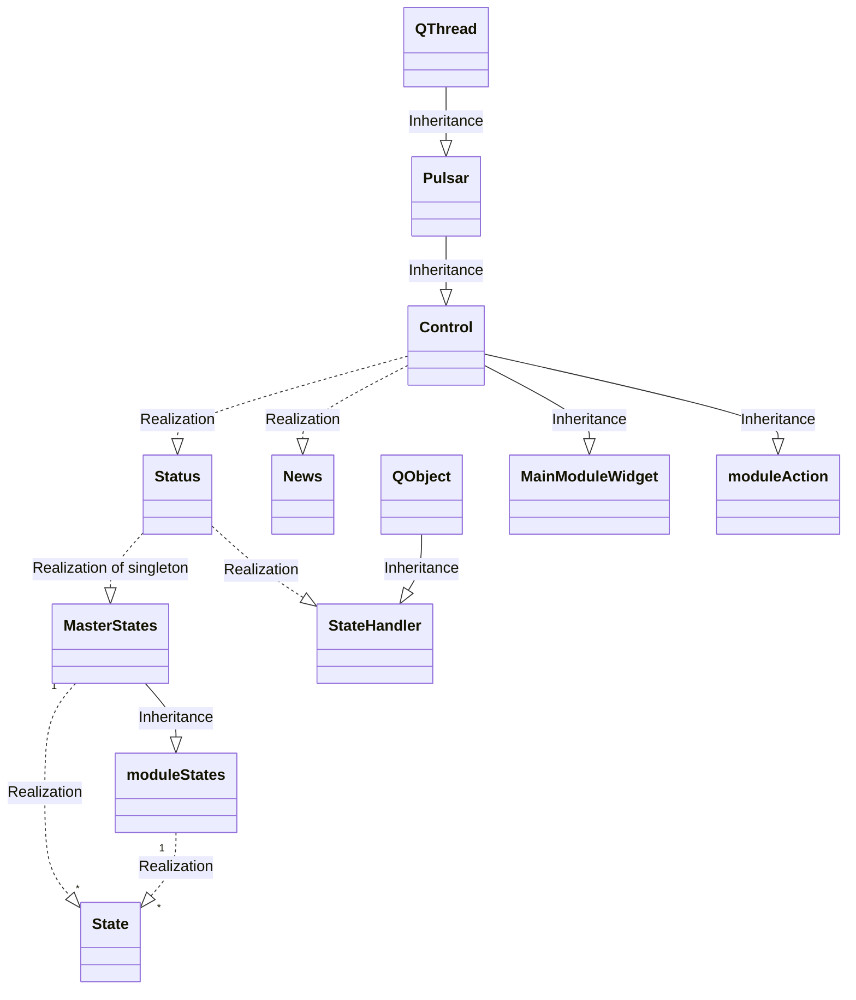

## Classes
Status is a singleton class  
News is a singleton class  
Control(Pulsar)  
StateHandler(QtCore.QObject)  
State  
MasterStates  
Pulsar(QtCore.QThread)  
MainModuleWidget(Control)  

# Main process class diagram

