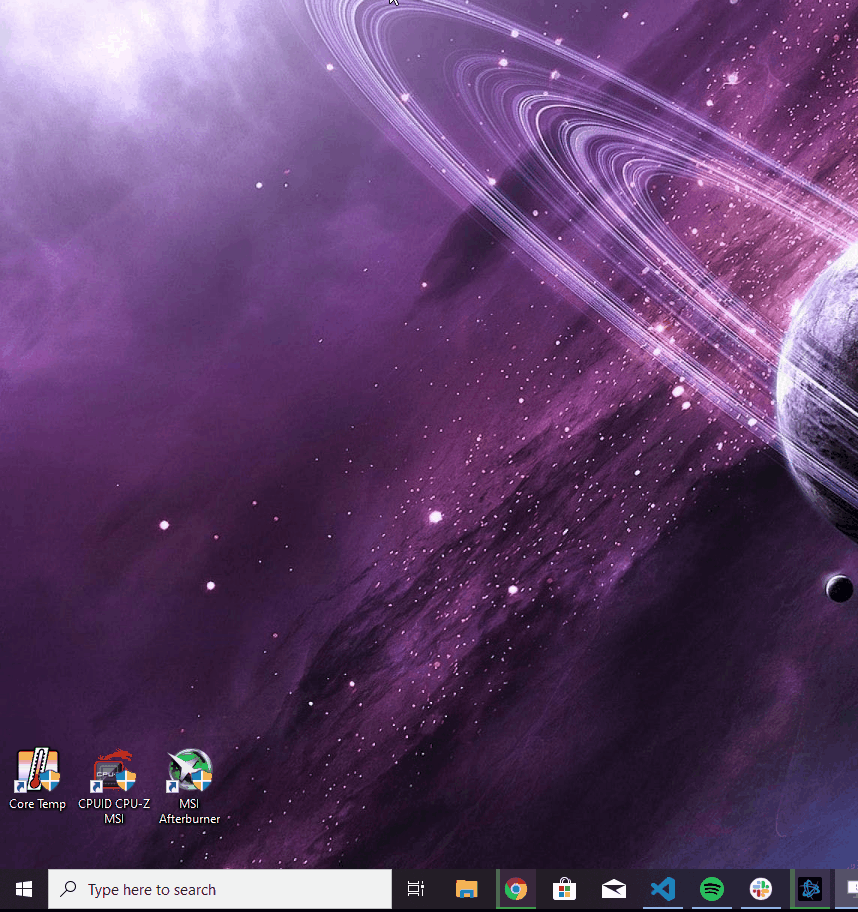
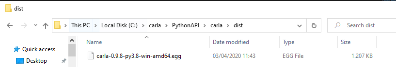
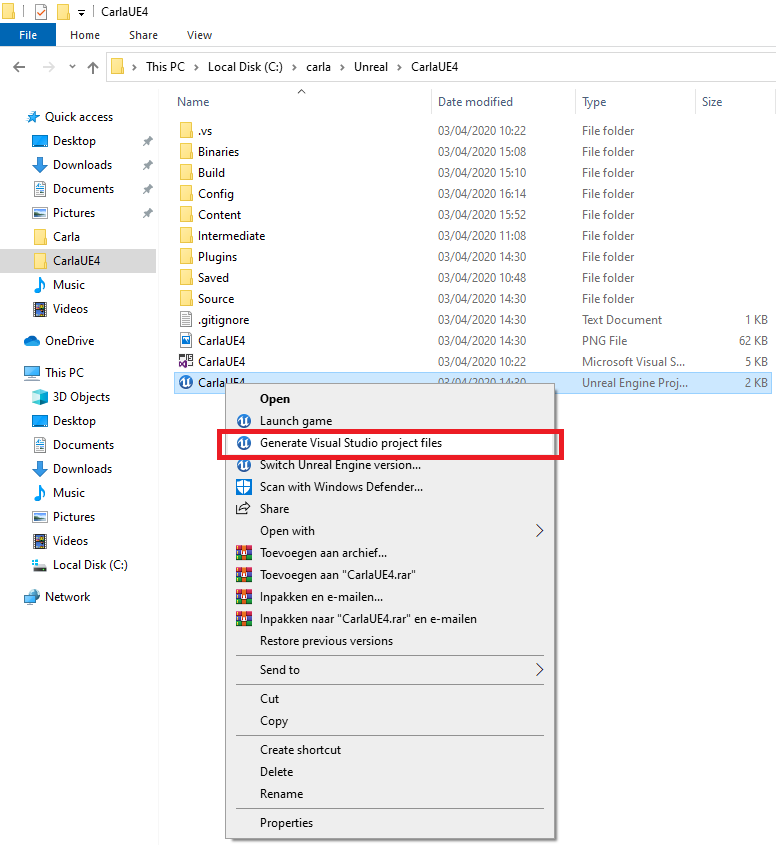

# Setting up CARLA for Windows

These instructions are complete and are heavily based on the awesome documentation provided by the CARLA team. If you get stuck somewhere, you could have a look at [their documentation](https://carla.readthedocs.io/en/latest/) as well.

---
## Introduction

In order to properly setup the simulation software on Windows several packages and steps are required, which will be elaborated upon in this section.

!!! Note
    This setup guide is extensive, if you are familiar with building software and installing new libraries etcetera, it might be easier to just scan through this guide instead of going through it thoroughly. However, if you don't, please follow the guide step by step.

---    
## Hardware Requirements

* __x64 system.__ The simulator should run in any 64 bits Windows system.  
* __50GB disk space.__ Installing all the software needed and CARLA will require quite a lot of space. Make sure to have about 50GB of space (especially since you will also need a visual studio 2017 install)
* __An adequate GPU.__ CARLA aims for realistic simulations, so the server needs at least a 4GB GPU. If VR is required a Turing based GPU (for example the RTX branch of NVIDIA is highly recommended!)
* __Two TCP ports and good internet connection.__ 2000 and 2001 by default. Be sure neither the firewall nor any other application are blocking these. 

---
## Required Software 

### Before you continue

Please make sure you have the following programs installed before continuing. If you will be installing them now, please read the instructions below carefully to prevent problems later on in the installation process.

* __[CMake](https://cmake.org/download/)__ *A small software package to make the CARLA build can compile C-code.* Please follow the link, scroll down and download the "Windows win64-x64 Installer" (there is no need to download the source). When installing select the option "Add CMake to the system `PATH` for all users"
* __[Git](https://git-scm.com/download/win)__ *Ensures version control of both the python software and CARLA64-bit Git for Windows Setup.* Please follow the link and download the "64-bit Git for Windows Setup.". During installation you can keep all the default settings but especially make sure to select the (default) option "Use Git from the Windows command prompt".
* __[Make](http://gnuwin32.sourceforge.net/packages/make.htm)__ *Generates the executables.* Please follow the link and download the "Complete package, except sources" setup. Install it and after installing add the binary folder (`C:\Program Files (x86)\GnuWin32\bin` by default) the the system `PATH` variable. follow the link in the info box below if you're not sure how to do this.
* __[PowerShell 5.0 or newer](https://www.microsoft.com/en-us/download/details.aspx?id=54616)__ If you have Windows 10, it already includes this. If however you are still using Windows 7, you need to update PowerShell to version 5.0 or newer to be able to use out-of-the-box build scripts provided with CARLA. Follow steps 1 to 3 [here](https://www.csoonline.com/article/3343048/how-to-install-powershell-5-on-windows-7.html)

!!! Important
    When you already have installed versions of the above mentioned software please make sure that the binary folders are added to the system's `PATH` variable! If you don't know how to do so, check 'Adding to System Variables'. If you have followed the instructions above, only make has to be added to the `PATH` manually.

### Visual Studio 2017

[Visual studio 2017](https://visualstudio.microsoft.com/vs/older-downloads/) is used as main building tool for the CARLA simulator. Make sure to use the 2017 version, newer or older version will not work. There two approaches you can follow: (1) install the build tools (requires less disk space) or (2) install VS2017 community edition.

!!! Important
    Other Visual Studio versions may conflicts later down the line. Even if these have been uninstalled, some registers may persist. To completely clean Visual Studio from the computer, go to `Program Files (x86)\Microsoft Visual Studio\Installer\resources\app\layout` and run `.\InstallCleanup.exe -full`

#### Approach 1: Build tools

For building CARLA, only the VS 2017 and .NET build tools are required, which requires significantly less disk space then a full version of Visual Studio. The build tools can be downloaded and installed by following the [link](https://visualstudio.microsoft.com/vs/older-downloads/) above. You need to log in with your Microsoft account (Hotmail, Live, etc). Please make sure to download the "Build Tools for Visual Studio 2017 (version 15.9)" executable (Check Visual Studio 2017 (version 15.9) under "Filter by product family"). Download and run the installer. 

In the installer, select the "Visual C++ build tools" and ".NET build tools" checkboxes in the left pane of the visual studio installer and select all the default options plus "Windows 8.1 SDK" in the column on the right. See the GIF below"

#### Approach 2: Visual Studio 2017 community edition

Alternatively, you can install the full Visual Studio community edition, this is a complete code editor but it will require some disk space. Download the Visual 2017 Studio Community edition installer by following the link above, again this will require creating an account and navigation the extensive downloads list. 
When installing please make sure you install it with the following properties:

Alternatively, you can install the full Visual Studio community edition, this is a complete code editor but it will require some disk space. Download the Visual 2017 Studio Community edition installer [here](https://visualstudio.microsoft.com/thank-you-downloading-visual-studio/?sku=Community&rel=15). 
When installing please make sure you install it with the following properties in Visual Studio Installer:

* __Windows 8.1 SDK.__ You can select this from the installation details tab
* __x64 Visual C++ Toolset__ Choose the __Desktop development with C++__, enabling a `x64` command prompt that will be needed. To access this prompt type in `x64` in the search bar of Windows 10. If properly installed it should show up like this:

### Unreal Engine 4.24

Go to __[Unreal Engine](https://www.unrealengine.com/download)__ and download the Epic Games Launcher. You will have to create an Epic Games account. In the Epic Games launcher go to 'unreal engine' in the left menu bar and then to 'library' and you should see something like this:

Download Unreal Engine 4.24.x and use the default install settings. Make sure to run it in order to check that everything was properly installed. Also, when right-clicking on `CarlaUE3.uproject` in `carla\Unreal\CarlaUE4`, you should see an option to Generate Visual Studio project files (but don't click it).

!!! Note
    If you get an error while installing the Unreal engine stating you do not have permission to install to ... (error code like DP-06), exit the Epic Games installer. Also make sure to complete quit the program (check in the system tray; is the Epic Game icon still there? Right-click &rarr; Exit). Then, run the Epic Game installer as administrator (right-click on Epic Game installer &rarr; Run as administrator). This should enable you to start the install.

    
### Python3 x64

 Install python 3 and __make sure you get the x64 version__ else it will not work, there is even some speculation that if you have a x32 version installed it can cause conflicts so its best to only have x64. At the time of writing this guide the working version of python is __[Python 3.8.2](https://www.python.org/downloads/release/python-382/)__

To check if we can run Python from the command line. And if the Python command links to the correct version of Python, it might not if you have multiple versions of Python installed. Open a command line window and type:

    python

This should give a response similar to the one below. Please make sure that you are running the Python version you have just installed.

    Python 3.8.2 (tags/v3.8.2:7b3ab59, Feb 25 2020, 23:03:10) [MSC v.1916 64 bit (AMD64)] on win32
    Type "help", "copyright", "credits" or "license" for more information.
    >>>
    
If Python does not start or if a different version is shown, you should make sure that the folder of your Python installation is in your `PATH` variables. Please check the bit on build dependencies above if you need help. If python opens Python 2.x but you also have Python 3.x installed, usually typing python3 will open the python 3.x version. Another known issue on Windows 10 is Windows opening the app store, please check [this page](https://superuser.com/questions/1437590/typing-python-on-windows-10-version-1903-command-prompt-opens-microsoft-stor) if that happens.

Please not the >>> symbols indicating that you are now within a python environment. To close Python again type:

    >>> exit() 

!!! Important
    Only use python 3, preferably python 3.8. Installing python 2.7 will be a waste of your time ;-)

---
## Building and installing CARLA & the CARLA PythonAPI

Before we start putting in commands in the recently setup x64 VS command prompt it is important to double check if you have all necessary software, and have it installed properly before you read on.
The build and install of the bare bones CARLA simulator can be divided in the following steps:

1. __Clone the repository__
2. __Get the latest CARLA assets__
3. __Get specific JOAN assets__
4. __Build PythonAPI__
5. __Build and launch CARLA__
6. __Wait and pray that your PC is fast enough to compile all the shaders in Unreal in a reasonable amount of time__
7. __Adding JOAN Assets inside Unreal__

The steps will be explained 1 step at the time with screenshots and command line commands you can easily copy paste.

### Step 1: Cloning the CARLA repository

To clone the repository either go to this [link](https://github.com/carla-simulator/carla) and download the zip file (click on 'Clone or download'), use a git client (SourceTree, GitHub desktop), or type in the following command in the command line of a Windows command prompt (make sure you are in the right directory!):

    # Clone the CARLA repository (will clone in the folder you are currently in in your terminal)
    git clone https://github.com/carla-simulator/carla

!!! Important 
    The CARLA build will fail if the `PATH` to CARLA contains spaces, so please clone CARLA to a folder without spaces in the path. If in doubt; use `C:\carla`. To do this navigate to `C:\` in a command prompt and call git clone from there, the `carla` folder will be created automatically. 

After cloning, verify that you have actually cloned the repository, it should look like this:

### Step 2: Getting latest CARLA assets

To get the latest CARLA assets open up the folder `Util` in the `carla` folder that you have just created in step 1, and open the file `contentversions.txt`, see below:

This text file contains the instructions of what to do to download the latest assets, for now get the 0.9.8 version. You can also click this [link](http://carla-assets.s3.amazonaws.com/20200306_06b6cb1.tar.gz). Note: this file is almost 10GB. To extract the compressed file, you can use [7-zip](https://www.7-zip.org/), for example.

Unpack these assets in `\carla\Unreal\CarlaUE4\Content\Carla`. If the directory does not exist, create it.

### Step 3: Get specific JOAN Assets

To have a nice car interior which also turns the steering wheel when you turn your physical steering wheel, some extra assets are required. You can download them [here](https://www.dropbox.com/s/7cboucrb81sdlxq/JOAN_Assets.zip?dl=0). The file contains:

* `JOAN_Blueprints`
* `JOAN_Static`
* `JOAN_Map`

Please copy the contents of `JOAN_Blueprints` to `\carla\Unreal\CarlaUE4\Content\Carla\Blueprints`. To be neat copy the vehicles in the vehicles blueprint folder.

Copy the contents of `JOAN_Static` (only cars) to `\carla\Unreal\CarlaUE4\Content\Carla\Static\Vehicles\4Wheeled`.

Then, copy all `.xodr` files in `JOAN_Map` to `\carla\Unreal\CarlaUE4\Content\Carla\Maps\OpenDrive`. Copy the remaining files in `JOAN_Map` to `\carla\Unreal\CarlaUE4\Content\Carla\Maps`. 

### Step 4: Build the PythonAPI

In order to build the python API open the 'x64 Native Tools Command Prompt for VS 2017' terminal. 

!!! Important
    Make sure you open the terminal as __administrator__! The VS 2017 Command Prompt window title should start with 'administrator'. The GIF below show you how to open a terminal as administrator

Navigate to the directory where you cloned CARLA and run the following command (if you don't know how to use the `cd` command to navigate in a terminal, check out [this page](https://www.computerhope.com/issues/chusedos.htm) first):

    make PythonAPI

You can see what should happen below:

If everything was successful you should be able to read 

    -[BuildPythonAPI]: Carla lib for python has been successfully installed in "C:\Users\<user>\repositories\carla\PythonAPI\carla\dist"!
    
Furthermore, a `carla.egg` file should be in `..\carla\PythonAPI\carla\dist`:

The exact filename depends on the CARLA version and python version (in our case python 3.8).

### Step 5: Building and launching CARLA

Essentially the steps here are exactly the same as the PythonAPI build, however as a precaution it is a good idea to do the following:

!!! Note
    If you do not see this option of 'Generate Visual Studio Project Files', you probably have not selected the right engine version. Try and run the 'UnrealSelectEngine' version in: `C:\Program Files\Epic Games\UE_4.24\Engine\Binaries\Win64`
    If this program is not present it is possible it is located in: `C:\Program Files (x86)\Epic Games\Launcher\Engine\Binaries\Win64`. Just copy the 'UnrealSelectEngine' program to the first mentioned folder. It should now associate the engine with Visual Studio.

Now open a "x64 Native Tools Command Prompt for VS 2017" the same way as in step 4, go to the CARLA folder and run the following command:

    make launch

!!! Note
    It is possible that during the make process you get the error that the Unreal editor cannot be found. To fix this, you need to add a new environment variable that points to UE4 called `UE4_ROOT` (most likely `C:\Users\<user>\Program Files\Epic Games\UE4.24`). Restart the `x64` terminal and try again.

If everything goes according to plan, this will build CARLA and eventually will launch the CarlaUE4 editor. This is automatically step 6!

### Step 6: CarlaUE4 editor compiling

The editor will be initializing for a while - no worries! It is compiling all the shaders and more. Check out Task Manager if you want

!!! Note
    The only important step here (if everything went well) is to remain patient, Unreal will have to compile _all_ shaders which is CPU heavy and can take up to 2 hours.

### Step 7: Adding vehicle assets to CARLA in Unreal

After the Unreal editor has been launched and compiled the shaders from step 6 go to the content browser and search for __'vehicle factory'__:

After the Unreal editor has been launched and compiled the shaders from step 6 go to the content browser and search for 'vehicle factory':

Open up this 'Blueprint' and then click on the array variable 'vehicles'. Now add to the array and select the vehicle blueprints you have selected. Give it a name you want to call it as from the PythonAPI, as a default use the ones shown here:

If all of the steps succeeded than congrats! You have successfully built CARLA, the basis of the JOAN simulator! Please proceed to the [setting up JOAN](./setup-joan.md).

---
## Adding to system variables

Usually when you install a software package the option to add to the `PATH` is already there you just have to check it. For example for the installation of python it is shown here:

However when this is not an available option, for example with make (gnuwin32), you can do the following:

