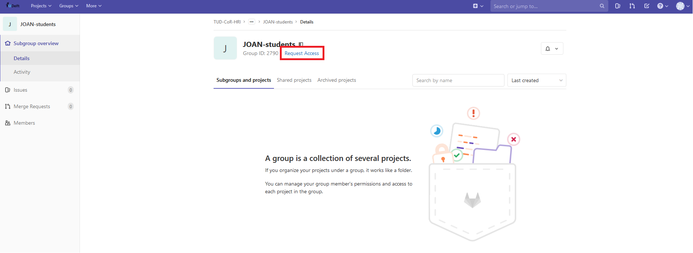
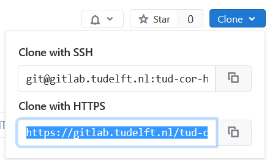
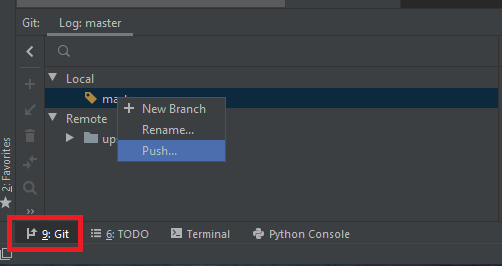

# Creating your own JOAN project

JOAN is maintained in a GitLab repository by a team of contributors. There are a couple of ways though which you can download JOAN:

- You can download a __zipped copy__ of the repository (note: you not receive any updates when we change the code)
- You can __clone__ the repository. However, if you do not have write permission to the repository, you can't make your own changes and store them on a repository (well, not easily).
- (_recommended for TUDelft students_) You can follow our instructions below to create your own repository and connect to JOAN to receive any updates. This allows you to receive any updates in the JOAN code, make your own research-specific changes and commit (e.g. store) them in your own repository! Awesome!

We will explain how to setup your own project repository and how to connect it to JOAN. This explanation will be tailored to TUDelft students who have access to the TUDelft GitLab server. We will explain these steps using PyCharm IDE. The steps are similar if you wish to use VS Code.

## Make your own JOAN project on gitlab.tudelft.nl

- Log in to the TUDelft's GitLab server at [gitlab.tudelft.nl](https://gitlab.tudelft.nl/) using your `netid`
- Go to the JOAN repository. You can either search for it, or use this [link](https://gitlab.tudelft.nl/tud-cor-hri/joan-framework/joan). Welcome! But do nothing - for now.
- Open a new browser tab, and navigate to the [JOAN-students group](https://gitlab.tudelft.nl/tud-cor-hri/joan-framework/joan-students). If you don't have access, you can request access through the "Request access" link (see the image below) Note: this group is visible to anyone with a TUDelft `netid`.
  
- Make a new project using the green 'New project' button. Please name your repository starting with JOAN, followed by your name and any other project description. Use hyphens. Example project name: `JOAN-niek-myfirstjoanproject`. Click on 'Create project'. You will be redirected to your empty repository page. 
- Do not close this webpage, we will need it in a moment.

---
## Clone your repository and connect it to the JOAN repository
- Launch PyCharm.
- In the 'Welcome to PyCharm' window, click on `Get from Version Control`. A new window appears:
  
- Go to your own repositories webpage, click `clone` and copy the URL under 'Clone with HTTPS':
  
- Paste the URL in the fiels that says URL in our PyCharm window. Change the directory to anything you like.
- Hit the button `Clone`
- PyCharm will start to clone your repository. This may fail, and trying this again could help. Furthermore, you might be asked to enter your credentials. If so, use your `netid`. Still credential/authority-related issues? Ask your supervisor.
- If everything goes to plan, you should see something like this (a new project, with the name you gave it online):
  

Now we need to connect the JOAN repository to your own repository, so that you are able to pull any changes we made and merge them into your own JOAN project. To do so, we will use PyCharm's terminal, which you can open by clicking the `Terminal` button in the button. It should show this: 

In the terminal type the following commands in this order (or copy it, and right-click paste in the terminal, `ctrl+v` does not work). Perform these commands one-by-one. Do not continue to the next command if the previous one returned errors!

    git remote add upstream-joan https://gitlab.tudelft.nl/tud-cor-hri/joan-framework/joan.git
    git fetch upstream-joan
    git pull upstream-joan master

The last command pulls the latest version of JOAN's master branch. Check out your PyCharm editor: you will find all folders and files of the latest JOAN version there: 

You also need to set your user name and email address for your repository (replace NETID and TUDELFT EMAIL ADDRESS, but lead the quotation marks):

    git config --local user.name "NETID"
    git config --local user.email "TUDELFT EMAIL ADDRESS"

Furthermore, we will set your user name such that GitLab knows who is pushing stuff to your repository. First, check the URL of the remote that is already setup for your repository. 

    git remote -v

You should see something like this:

    (venv) (base) PS C:\Users\USER\repositories\joan-niek-myfirstjoanproject> git remote -v
    origin  https://gitlab.tudelft.nl/tud-cor-hri/joan-framework/joan-students/joan-niek-myfirstjoanproject.git (fetch)
    origin  https://gitlab.tudelft.nl/tud-cor-hri/joan-framework/joan-students/joan-niek-myfirstjoanproject.git (push)
    upstream-joan        https://gitlab.tudelft.nl/tud-cor-hri/joan-framework/joan.git (fetch)
    upstream-joan        https://gitlab.tudelft.nl/tud-cor-hri/joan-framework/joan.git (push)
    (venv) (base) PS C:\Users\USER\repositories\joan-niek-myfirstjoanproject>

The first two labeled `origin` are the URLs to your own project. The ones labeled `upstream-joan` are for the JOAN repository. We need the `origin` one for the next step. We are going to add your NetID to the `origin` URL as follows (replace NETID with your own NetID, note the '@' and make sure to copy your own origin URL):

    git remote set-url origin https://NETID@gitlab.tudelft.nl/tud-cor-hri/joan-framework/joan-students/joan-niek-myfirstjoanproject.git

Check if the URL is changed properly:

    git remote -v

You should see your NETID in the `origin` URL now.

We now need to make sure that you `push` your first version of your own JOAN project to your repository. It is possible that on your first `push`, the git credential manager might ask you for your password. Use the password associated with your NetID.

- In PyCharm, Click on 9: Git (bottom-left).
- Right click on `master` (under `Local`) and click on `Push...` and `Push` again in the pop-up window. This may take a while.
- You might need to fill out your `netid` credentials.
- Congratulations! You just pushed the first version of your JOAN project to your online repository. Check out your repository webpage on GitLab, everything's there!

!!! Note 
    If you cannot seem to push to your own project, something might be wrong with your permissions. Check if you are a maintainer on your repository. If not, contact the group Owner.
