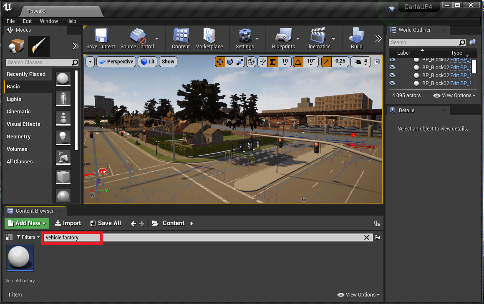

# Setting up JOAN
Once you have CARLA running, the hard part is over. JOAN is a relative walk in the park, except perhaps for setting up a project repository if you have little experience with this.

### Obtaining JOAN

!!! Important
    TU Delft students, please use step 2 on the page ["Setup JOAN on TUD Hardware"](https://joan.readthedocs.org/setup-on-tud-shared-hardware/#step-2-clone-your-joan-project) to setup your own repository and clone JOAN.
   
JOAN is maintained in a [GitHub repository](https://github.com/tud-hri/joan) by a team of contributors. There are a couple of ways through which you can download JOAN:

- You can __fork__ the repository on GitHub ([see instructions to fork here](https://docs.github.com/en/get-started/quickstart/fork-a-repo)). This allows you to change JOAN to your
  liking, contribute to the main repository, but also keep track of your changes on your own `git` repository.
- You can __clone__ the JOAN repository directly using the command `git clone`. However, if you do not have write permission to the repository, you can't make your changes and
  store them on a repository (well, not easily).
- You can download a __zipped copy__ of the repository (note: you don't receive any updates when we change the code)


### Adding JOAN assets 

* We prepared a map and other assets to get you started with JOAN. Download the assets [here](https://doi.org/10.4121/19419923){target="_blank"}, extract it, and copy the contents to `C:\carla\Unreal\CarlaUE4\Content\Carla`.
* Now, you need to manually add the downloaded JOAN assets to CARLA to make sure you can actually use them. 
    1.After the Unreal Editor has been launched and compiled the shaders, go to the content browser (lower half of the screen) and search for __'vehicle factory'__:
    
    2. Open up this 'Blueprint' and then click on the array variable 'vehicles'. 
    3. Now add to the array  (click the plus icon); a new entry should open. Under 'Make', type 'HapticsLab' and
Model, type 'Audi'. Select the 'BP_EpicAudi2' blueprint (and it has 4 wheels):
        
    4. Save (using ctrl + s) and close the blueprint. 
* Finally, you need to set the 'Game Mode' to JOAN. This ensures that the player visuals are locked to the ego vehicle.
    1.  Click Edit -> Project Settings
    2. In the left pane, click Maps & Modes
    3. For Default Game Mode, select JOANGameMode
    4. For the Default game map and Editor startup map, select DemoMap
    5. Close the settings window

### Setting up Python environment
Finally, you need to set up the python environment and install the requirements to run JOAN.

+ We recommend setting up a python virtual environment for JOAN (note: use python > 3.6). In a terminal, navigate to the Joan directory, and execute the following command:

```commandline
python -m venv venv
```

+ If the environment is active, you'll likely see `(venv)` before each command line. If not, run the following command (assuming Windows):

```commandline
venv\Scripts\activate.bat
```

+ Install the dependencies using `pip` 

```commandline
pip install -r requirements.txt
```

+ To install Carla, please make sure to use the `.whl` file (since the JOAN code assumes you do). This file is built after running the `make PythonAPI` command (see the carla documentation) is successfully executed. As the Carla documentation describes, make sure to locate this `.whl` file. and then install carla using:
```commandline
pip install <path/to/wheel>.whl
``` 

### Test Your JOAN installation
Now it is time to test if the JOAN installation worked. If you run the script `main.py` (from the command line or your favorite IDE) JOAN should start. To connect to Carla, you first need to click the play button in the Unreal Editor to start Carla.

## Adding your own CARLA map

When doing research with JOAN, it is likely that you'll need your own custom map. These instructions are specifically written for TU Delft students but are useful for others too.

- Create a folder with the name `<YEAR>_<NETID>` in the directory `C:\carla\Unreal\CarlaUE4\Content\Research\` (create the folder `Research` if it does not exist).
- Download the template map [here](https://doi.org/10.4121/19419923){target="_blank"}, extract it, and copy the folder called `Maps` it in your
  own folder under `C:\carla\Unreal\CarlaUE4\Content\Research\<YEAR>_<NETID>\`.
- Open the Epic Game Launcher (you might need to log in; use your login of choice).
- Launch Unreal Engine, top-right corner (Unreal should be installed; if not, restart the Epic Game Launcher or reboot the computer, this normally works).
- In Unreal Engine, CarlaUE4 should be listed under 'Recent projects'. If not, open the `CarlaUE4` project (browse to `C:\carla\Unreal\CarlaUE4\` and open `CarlaUE4.uproject`).
- The CarlaUE4 will now start; this may take a while if you start it for the first time.
- To open your level, click `File` &rarr; `Open level` and select `DebugMap.umap` __in your folder__ (navigate to your 'Research' folder!)
- If you want, you can rename your map to a more descriptive name (right-click on the map in the editor &rarr; `rename`, for example, `<YEAR>_Map_<NAME>_<SHORT DESCRIPTION>`, or
  use `File` &rarr; `Save as`).
- Your level will load, but this may take some time.
- To run the Unreal Engine, hit the play button.

!!! Warning 
    Make sure to load your map, so double-check that you are in the right directory when opening your level!
