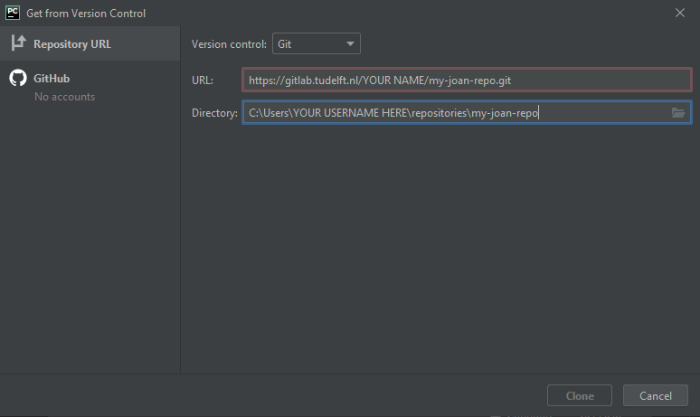

# Setting up JOAN

Once you have CARLA running, the hard part is over. JOAN is a relative walk in the park, except perhaps for setting up a project repository if you have little experience with this.

---

JOAN is maintained in a [GitHub repository](https://github.com/tud-hri/joan) by a team of contributors. There are a couple of ways through which you can download JOAN:

- You can download a __zipped copy__ of the repository (note: you don't receive any updates when we change the code)
- You can __fork__ the repository on GitHub ([see instructions to fork here](https://docs.github.com/en/get-started/quickstart/fork-a-repo)). This allows you to change JOAN to your
  liking, contribute to the main repository, but also keep track of your changes on your own `git` repository (recommended for TU Delft students).
- You can __clone__ the JOAN repository directly using the command `git clone`. However, if you do not have write permission to the repository, you can't make your changes and
  store them on a repository (well, not easily).

We will explain how to create your own project using PyCharm.
+ Fork JOAN on GitHub (fork gives you more independence in changing JOAN for your particular project).
  See [these instructions on how to fork JOAN on github](https://docs.github.com/en/get-started/quickstart/fork-a-repo).
+ Once you forked JOAN, you still need to clone your own forked JOAN project); just make sure to change the URL of your forked repo. You can either use the command line or through
  PyCharm (when creating a new project):
```commandline
git clone <URL TO YOUR GITHUB JOAN REPOSITORY>
cd <DIRECTORY OF YOUR REPOSITORY>
```

When using PyCharm: If PyCharm automatically opens an existing project that is not yours, close the project (`File` &rarr; `Close project`). A welcome screen should appear. In
the 'Welcome to PyCharm' window, click on `Get from Version Control`. A new window appears:

Go to your own repository's webpage (on GitHub), click `clone`, and copy the URL under 'Clone with HTTPS':

**TU Delft students**: Paste the repository URL in the field that says URL in the PyCharm window. Change the directory to `C:\\Users\<YOUR NETID>\joan-projects\<YOUR PROJECT NAME>`
. Replace `<NETID>` with your NETID if you are on a TUD computer or your Windows username and `<YOUR PROJECT NAME>` with the __EXACT__ name of your GitLab repository project.

+ In the terminal type the following commands in this order (or copy it, and right-click paste in the terminal, `ctrl+v` does not work). This adds the original JOAN repository as
  upstream, enabling you to pull the latest version of JOAN.

```commandline
git remote add upstream-joan https://github.com/tud-hri/joan.git
git fetch upstream-joan
git pull upstream-joan master
```

+ You also need to set your user name and email address for your repository:

```commandline
git config --local user.name "YOUR NAME"
git config --local user.email "YOUR EMAIL ADDRESS"  
```

+ We prepared a map and other assets to test CARLA + JOAN functionality. Download the
  assets [here](https://doi.org/10.4121/19419923){target="_blank"}, extract it, and copy the contents
  to `C:\carla\Unreal\CarlaUE4\Content\Carla`. Check whether you added the vehicle 'hapticslab.audi' to CARLA's vehicle
  factory [(see here for instruction, under ### Step 7: Adding vehicle assets to CARLA in Unreal)](setup-carla-windows.md)

+ We recommend setting up a python virtual environment for JOAN (note: use python > 3.6). In a terminal, navigate to the Joan directory, and execute:

```commandline
python -m venv venv
```

+ If the environment is active, you'll likely see `(venv)` before each command line. If not, run the following command (assuming Windows):

```commandline
venv\Scripts\activate.bat
```

+ Install the dependencies using `pip` (see step 4)

```commandline
pip install -r requirements.txt
```

+ Copy the CARLA `.egg` file to the folder `joan/carla_pythonapi` (see steps 4 and 5 [here](setup-carla-windows.md))

+ Check what modules you want to include in `main.py`, and execute `main.py`.

```python
python
main.py
```

!!! Tip To retrieve the latest version of JOAN:
```commandline git fetch upstream-joan git pull upstream-joan master
```
!!! Important conflicts may occur when pulling the latest JOAN version. These conflicts are between changes you made and changes in the main JOAN code. Often, these
conflicts can be resolved through PyCharm, but sometimes it is more difficult than this. If you're used to git, resolve all conflicts by yourself. Else, perhaps good to ask your
supervisor.

## Adding your own CARLA map

These instructions are specifically written for TU Delft students but are useful for others too.

!!! Note 
    (Tested in June 2022) Some errors may occur when trying to compile your map. Make sure that the following steps are followed.
    Go to Project Settings in Unreal. Then move over to `Project > Packaging`. In the `Packaging` tab, click on `Show advanced` and under `Directories to never cook` add `/Game/Carla/Blueprints/Lights`. 

!!! Note 
    To prevent errors with the weather settings, when adding your map to the maps folder, also add your map to `BP_Weather`. 
    This can be done by opening `BP_Weather` in the folder `/Carla/Blueprints/Weather`. In the `Get Town` function, click on the `Default Weathers` block. Now click the plus (Add elements) and add the name of your map.

- Create a folder with the name `<YEAR>_<NETID>` in the directory `C:\carla\Unreal\CarlaUE4\Content\Research\` (create the folder `Research` if it does not exist).
- Download the template map [here](https://doi.org/10.4121/19419923){target="_blank"}, extract it, and copy the folder called `Maps` it in your
  own folder under `C:\carla\Unreal\CarlaUE4\Content\Research\<YEAR>_<NETID>\`.
- Open the Epic Game Launcher (you might need to log in; use your login of choice).
- Launch Unreal Engine, top-right corner (Unreal should be installed; if not, restart the Epic Game Launcher or reboot the computer, this normally works).
- In Unreal Engine, CarlaUE4 should be listed under 'Recent projects'. If not, open the `CarlaUE4` project (browse to `C:\carla\Unreal\CarlaUE4\` and open `CarlaUE4.uproject`).
- The CarlaUE4 will now start; this may take a while if you start it for the first time.
- To open your level, click `File` &rarr; `Open level` and select `DebugMap.umap` __in your folder__ (navigate to your 'Research' folder!)
- If you want, you can rename your map to a more descriptive name (right-click on the map in the editor &rarr; `rename`, for example, `<YEAR>_Map_<NAME>_<SHORT DESCRIPTION>`, or
  use `File` &rarr; `Save as`).
- Your level will load, but this may take some time.
- To run the Unreal Engine, hit the play button.

!!! Warning 
    Make sure to load your map, so double-check that you are in the right directory when opening your level!
