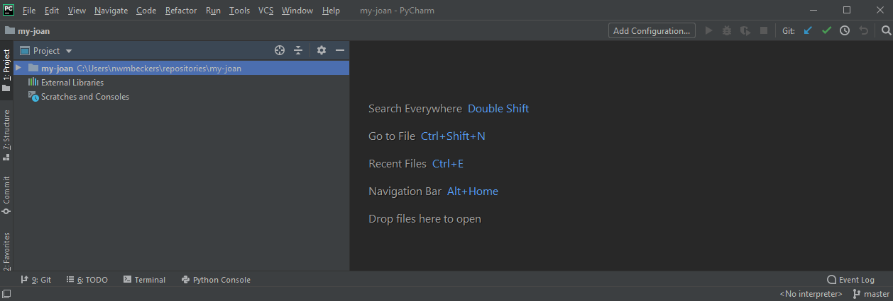
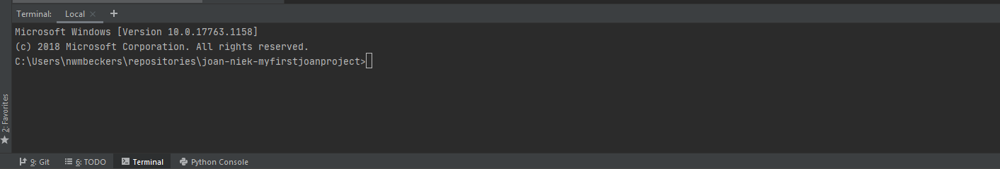
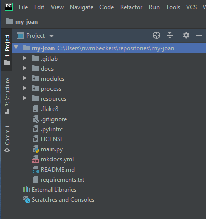

# Setting up JOAN

Once you have CARLA running, the hard part is over. JOAN is a relative walk in the park, except perhaps for setting up a project repository. TU Delft students need to follow all steps in the 'Less-quick start' guide.

## Quick start

1. Clone JOAN in the directory of your choice
```
git clone https://github.com/tud-hri/joan.git
cd joan
```

2. We recommend setting up a python virtual environment for JOAN (note: use python > 3.6). In a terminal, check whether you are in the joan repository, and execute:
```
python -m venv venv
```
3. Install the dependencies using `pip` (see step 4) 
```
pip install -r requirements.txt
```
4. Include the CARLA `.egg` file in the JOAN project (see step 5)

5. If you want to use `git` for your own project, set up your own remote project (see step 2).

6. Check what modules you want to include in `main.py`, and execute `main.py`.

```python
python main.py
```

---

## Less-quick start

Please follow the following steps:

1. __Create your own JOAN project__
2. __Clone your project repository__
3. __Set up a Python Virtual Environment__
4. __Retrieve the Python libraries__
5. __Include the CARLA .*egg file in your JOAN project__

Step 1 you need to do only once per project. Step 2, cloning your project, is something you need to do on every computer that you use for working with JOAN. Suppose you move from one PC to another and you have not cloned your project on that computer, you need to do step 2. Similarly, you need to do steps 3 and 4 when setting up your project for the first time. 

Finally, you need to update your project with the latest version of JOAN. We try to update JOAN regularly, based on the issues we all find and features we want to include. It is good practice to regularly update your project. See the final step below for more info.

---
## Step 1. Create your own JOAN project

JOAN is maintained in a GitLab repository by a team of contributors. There are a couple of ways though which you can download JOAN:

- You can download a __zipped copy__ of the repository (note: you don't receive any updates when we change the code)
- You can __clone__ the repository using the command `git clone . However, if you do not have write permission to the repository, you can't make your own changes and store them on a repository (well, not easily).
- (_recommended for TU Delft students_) You can follow our instructions below to create your own repository and connect to JOAN to receive any updates. This allows you to receive any updates in the JOAN code, make your own research-specific changes and commit (e.g. store) them in your own repository! Awesome!

We will explain how to setup your own project repository and how to connect it to JOAN. This explanation will be tailored to TUDelft students who have access to the TUDelft GitLab server. However, you can also use GitHub, create your own project there and take similar steps. We will explain these steps using PyCharm IDE.

### Make your own JOAN project on gitlab.tudelft.nl (TU Delft students and employees only)

- Log in to the TUDelft's GitLab server at [gitlab.tudelft.nl](https://gitlab.tudelft.nl/){target="_blank"} using your `netid`
- Go to the JOAN repository. You can either search for it, or use this [link](https://gitlab.tudelft.nl/tud-cor-hri/joan-framework/joan){target="_blank"}. Welcome! But do nothing - for now.
- Open a new browser tab, and navigate to the [JOAN-students group](https://gitlab.tudelft.nl/tud-cor-hri/joan-framework/joan-students){target="_blank"}. If you don't have access, you can request access through the "Request access" link (see the image below) Note: this group is visible to anyone with a TUDelft `netid`.
  
    - For PhD researchers, please use the JOAN-projects group.
- Make a new project using the green 'New project' button. Please name your repository starting with JOAN, followed by your name and any other project description. Use hyphens. Example project name: `JOAN-niek-myfirstjoanproject`. Click on 'Create project'. You will be redirected to your empty repository page. 

!!!Note
    When asked, do not automatically create a readme file on gitlab

- Do not close this webpage, we will need it in a moment.

---
## Step 2. Clone your repository and connect it to the JOAN repository


- Launch PyCharm. If PyCharm automatically opens an existing project that is not yours, close the project (`File` &rarr; `Close project`). A welcome screen should appear.
- In the 'Welcome to PyCharm' window, click on `Get from Version Control`. A new window appears:
  
- Go to your own repositories webpage (on GitLab), click `clone` and copy the URL under 'Clone with HTTPS':
  
- Paste the repository URL in the field that says URL in the PyCharm window. Change the directory to `C:\\Users\<YOUR NETID>\joan-projects\<YOUR PROJECT NAME>`. Replace `<NETID>` with your NETID if you are on a TUD computer or your Windows username and `<YOUR PROJECT NAME>` with the __EXACT__ name of your gitlab repository project. 
- Click `Clone`
- Fill in your NETID credentials.
- PyCharm will start to clone your repository. This may fail, and trying this again could help. Furthermore, you might be asked to enter your credentials. If so, use your `netid`. Still credential/authority-related issues? Ask your supervisor.
- If everything goes to plan, you should see something like this (a new project, with the name you gave it online):
  

Now we need to connect the JOAN repository to your own repository, so that you are able to pull any changes we made and merge them into your own JOAN project. To do so, we will use PyCharm's terminal, which you can open by clicking the `Terminal` button in the button. It should show this: 


In the terminal type the following commands in this order (or copy it, and right-click paste in the terminal, `ctrl+v` does not work). Perform these commands one-by-one. Do not continue to the next command if the previous one returned errors!

    git remote add upstream-joan https://github.com/tud-hri/joan.git
    git fetch upstream-joan
    git pull upstream-joan master

The last command pulls the latest version of JOAN's `master` branch. Check out your PyCharm editor: you will find all folders and files of the latest JOAN version there: 



You also need to set your user name and email address for your repository (replace NETID and TUDELFT EMAIL ADDRESS, but lead the quotation marks):

    git config --local user.name "NETID"
    git config --local user.email "TUDELFT EMAIL ADDRESS"

!!! Important
    This step is very important! Make sure to include the `--local` argument.

Furthermore, we will set your user name such that GitLab knows who is pushing stuff to your repository. First, check the URL of the remote that is already setup for your repository. 

    git remote -v

You should see something like this:

    C:\Users\<NETID>\joan-projects\<YOUR PROJECT NAME> git remote -v
    origin  https://gitlab.tudelft.nl/tud-cor-hri/joan-framework/joan-students/<YOUR PROJECT NAME>.git (fetch)
    origin  https://gitlab.tudelft.nl/tud-cor-hri/joan-framework/joan-students/<YOUR PROJECT NAME>.git (push)
    upstream-joan        https://github.com/tud-hri/joan.git (fetch)
    upstream-joan        https://github.com/tud-hri/joan.git (push)
    C:\Users\<NETID>\joan-projects\<YOUR PROJECT NAME>

The first two labeled `origin` are the URLs to your own project. The ones labeled `upstream-joan` are for the JOAN repository. We need the `origin` one for the next step. We are going to add your NetID to the `origin` URL as follows (replace NETID with your own NetID, note the '@' and make sure to copy your own origin URL):

    git remote set-url origin https://<NETID>@gitlab.tudelft.nl/tud-cor-hri/joan-framework/joan-students/<YOUR PROJECT NAME>.git

!!! Important
    Replace `<NETID>` and `<YOUR PROJECT NAME>` with your NetID and project name

Check if the URL is changed properly:

    git remote -v

You should see your NETID in the `origin` URL now before the `gitlab.tudelft.nl/tud-cor-hri/...`, followed with an `@`.

We now need to make sure that you `push` your first version of your own JOAN project to your repository. It is possible that on your first `push`, the git credential manager might ask you for your password. Use the password associated with your NetID.


- In PyCharm, Click on 9: Git (bottom-left).
- Right click on `master` (under `Local`) and click on `Push...` and `Push` again in the pop-up window. This may take a while.
- You might need to fill out your `netid` credentials.
- Congratulations! You just pushed the first version of your JOAN project to your online repository. Check out your repository webpage on GitLab, everything's there!

!!! Note 
    If you cannot seem to push to your own project, something might be wrong with your permissions. Check if you are a maintainer on your repository. If not, contact the group Owner (on Gitlab, go to the `JOAN-students` group, click on Members (on the left). You should see who the Owner is).

---
## Step 3. Set up a Python Virtual Environment
If this is the first time setting up the project on your pc, you need to create a Python virtual environment. This will help keeping your JOAN project separate from your other projects. If you are interested and would like more information on virtual environments, please read [this](https://docs.python.org/3/tutorial/venv.html){target="_blank"}. But for now you can also just follow these steps.

Using PyCharm, open the terminal again (in PyCharm), check if the directory is still correct (of your repository) and type:

    python -m venv venv

!!! Note
    If you don't use PyCharm, just use any other terminal to do these steps.

This will create a folder called `venv` containing a new and clean virtual environment. To start working in this environment, we have to activate it first. 

If you are using PyCharm, you might need to add your virtual environment as a Python interpreter. Click on the interpreter widget in the bottom right next to `master` (it should say something with interpreter) and click `Add interpreter`.  It should automatically select the _existing_ `venv` Python interpreter (__do not create a new environment__). Confirm everything and wait for a bit. PyCharm should show the Python version of your venv in the bottom-right corner. 

Then type in the terminal:

    venv\Scripts\activate # windows

If this succeeds, (`venv`) should have appeared in your command line trailing your current location. This indicates that the Python command points to the virtual environment. 

---
## Step 4. Retrieve necessary Python libraries
To get JOAN to work together with CARLA you will need several python packages (and if you want to use a SensoDrive steering wheel with CAN interface also a specific DLL). The list of required pip installs is saved in the requirements.txt file.
To install all requirements from the command prompt, make sure you are in the project folder and have the virtual environment activated. Now type: 

    pip install -r requirements.txt 

!!! Note
    Every time you clone your project on a new computer, you need to do this step


---
## Step 5. Include the CARLA .egg file
The only dependency not in the `requirements.txt` is the CARLA PythonAPI which we built earlier. To use this dependency __copy__ the `*.egg` (navigate to `C:\carla\PythonAPI\carla\dist` in Windows file explorer) file to the empty folder `CARLA_PythonAPI` in your JOAN project folder (`C:\Users\<NETID>\joan-project\<YOUR PROJECT NAME>\carla_pythonapi`). If you have not done this step you will get an error message whenever you start JOAN.
    
!!! Important
    Please note that the file name of the `*.egg` file might be slightly different in your case, it depends on the Python version.


--- 
## Updating your project with the latest JOAN version

Finally, you need to update your project with the latest version of JOAN. We try to update JOAN regularly, based on the issues we all find and features we want to include. It is good practice to regularly update your project. To do this: 

    git fetch upstream-joan
    git pull upstream-joan master

These commands will pull any changes from the main JOAN repository into your project.

!!! Important
    It is possible that conflicts occur when pulling the latest JOAN version. These conflicts are between changes you made and changes in the main JOAN code. Often, these conflicts can be resolved through PyCharm, but sometimes it is more difficult than this. If you're used to git, resolve all conflicts by yourself. Else, perhaps good to ask your supervisor.
