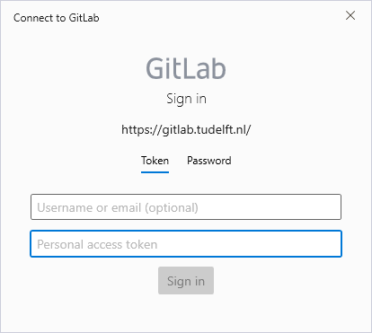

# Working with JOAN and CARLA on shared TU Delft hardware

These instructions are specifically for students at TU Delft, but they may be useful for others too. 

If you are a student at the TUD, you will share hardware (computers, steering wheels) with your fellow students. To make sure we keep everything organized, you need to follow the next steps for every computer you want to install your project on.

---

## Step 1: preparations

- Log in with your TU Delft NetID.
- If correct, CARLA (see `C:\carla`), python 3.8.5 (64 bit; type `python` in a command terminal, you should see a python version > 3.8), and PyCharm are already installed. 

!!! Note
    If you need to do a fresh install (CARLA, python, PyCharm, ...) on the computer, follow the steps in both the [Build CARLA on Windows](setup-carla-windows.md) and [Install JOAN](setup-joan.md) pages. This needs to be done as an administrator to make CARLA, Python, and PyCharm available for everyone. Ask your supervisor first.

!!! Important
    Make sure that [the windows build version CARLA 0.9.13](https://carla.readthedocs.io/en/0.9.13/build_windows){target="_blank"} is installed. Else, please go back to the [Build CARLA on Windows](setup-carla-windows.md) and [Install JOAN](setup-joan.md) pages. It may be a good idea to check out these installation pages anyhow!

## Step 2: clone your JOAN project

We will explain how to create your own git repository on GitLab and set the JOAN GitHub repository as the upstream project.

1. Go to [gitlab.tudelft.nl](https://gitlab.tudelft.nl) and login with your NETID. This activates your gitlab account. For TU research and thesis projects, we use the gitlab server because it is hosted by TU Delft and allows for free private repositories. Besides that, this allows your supervisor to access your code during and after your project. Which in the end is helpful for you because your supervisor can easily help you.
2. Ask your supervisor to create a gitlab repository for you on the TU Delft server. (Because students are not allowed to create projects.) 
    * Instructions for supervisors: Create a new repo in the group TUD-CoR-HRI > JOAN framework > JOAN-students. Use the "import project" option (after clicking "new project") to copy the contents from the main JOAN repository on GitHub.
3. Check you can access your repository on GitLab. This should contain the latest version of JOAN. 
4. Create an access token for the project. Click `settings` -> `access tokens` in the left menu on the project page. Create a new token, this token will appear on top of the page after you clicked the `create button`. Make sure to copy and store it. 
4. Clone your new personal JOAN project repository. 
    * Open a commandline window and navigate to the folder where you want to create your project (e.g., `USER_HOME\PycharmProjects\`)
    * Go to your own repository's webpage (on GitHub), click `clone`, and copy the URL under 'Clone with HTTPS':
    
    * Type the following command in your command line window:  
        ```commandline
        git clone <URL TO YOUR GITHUB JOAN REPOSITORY>
        ```
    * Use your NetID and access token in the following window to get access to your repository.
    
5. Finally, you'll need to add the original JOAN repository from GitHub as a second remote server. This will allow you to pull updates from the main JOAN repo if needed. To do this, use the following commands in your commandline:
    ```commandline
    cd <YOUR_PROJECT_FOLDER>
    git remote add upstream-joan https://github.com/tud-hri/joan.git
    git fetch upstream-joan
    ```
## Step 3: finish the JOAN installation
Now that you have obtained your version of JOAN, you'll need to finish the installation. Go back to the page [setup JOAN](setup-joan.md), and resume the installation from the step 'Adding JOAN assets'. 
    
## Reserving and sharing the TUD computers

We have limited hardware at the TUD for you to work on. Please share the PCs fairly with your fellow students. You can coordinate through Slack (joan-forum, for example).
