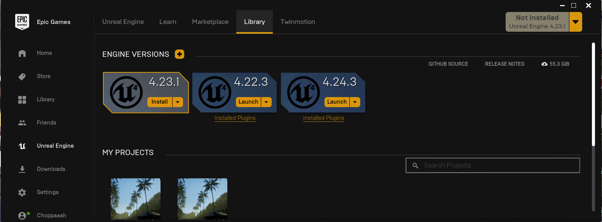
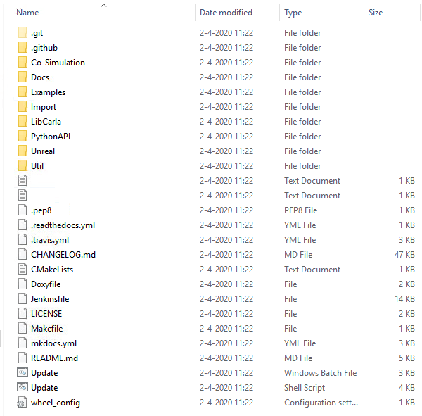

# Setting up the simulator for Windows Documentation

## Introduction
In order to properly setup the simulation software on Windows several packages and steps are required, which will be elaborated upon in this section.
!!! Note
    This setup guide is extensive, if you are familiar with building software and installing new libraries etc it might be easier to just scan through this guide instead of going through it thoroughly. However, if you dont, please follow the guide step by step.
## Hardware Requirements
* __x64 system.__ The simulator should run in any 64 bits Windows system.  
* __50GB disk space.__ Installing all the software needed and CARLA will require quite a lot of space. Make sure to have about 50gb of space (especially since you will also need a visual studio 2017 install)
* __An adequate GPU.__ CARLA aims for realistic simulations, so the server needs at least a 4GB GPU. If VR is required a turing based GPU (for example the RTX branch of NVIDIA is highly recommended!)
* __Two TCP ports and good internet connection.__ 2000 and 2001 by default. Be sure neither the firewall nor any other application are blocking these. 

## Required Software 
### Minor Building Dependencies
* __[CMake](https://cmake.org/download/)__ A small software package to make the CARLA build can compile C-code.
* __[Git](https://git-scm.com/downloads)__ Ensures version control of both the python software and CARLA
* __[Make](http://gnuwin32.sourceforge.net/packages/make.htm)__ Generates the executables.  

!!! Important
    When you install the above mentioned software make sure you add the binary maps to the system path! If you dont know how to do so, please click this link: [Adding to System Variables](/sysPath)

### Visual Studio 2017
[Visual studio 2017](https://visualstudio.microsoft.com/vs/older-downloads/) is used as main building tool for the CARLA simulator. Make sure you install it with the following properties:

* __Windows 8.1 SDK.__ You can select this from the installation details tab
* __x64 Visual C++ Toolset__ Choose the __Desktop development with C++__, enabling a x64 command prompt that will be needed. To access this prompt type in x64 in the search bar of windows 10. If properly installed it should show up like this:

### Unreal Engine 4.24
Go to __[Unreal Engine](https://www.unrealengine.com/download)__ and download the Epic Games Launcher. You will have to create an epic games account before you are able to download the epic games launcher. In the epic games launcher go to 'unreal engine' in the left menu bar and then to 'library' and you should see something like this:

Download Unreal Engine 4.24.x. Make sure to run it in order to check that everything was properly installed.

### Python3 x64
 Install python 3 and __make sure you get the x64 version__ else it will not work, there is even some speculation that if you have a x32 version installed it can cause conflicts so its best to only have x64. At the time of writing this guide the working version of python is __[Python 3.8.2](https://www.python.org/downloads/release/python-382/)__

!!! Important
    Really do use python 3, do not try and use python 2 it will just not work.

### Visual Code (Optional)
Ofcourse you are free to use any IDE you are comfortable with (pycharm, spyder, anaconda), however the authors and creators of the JOAN simulator have consistently used __[Visual Studio Code](https://code.visualstudio.com/)__ due to easy source control functionality.

## Building and installing CARLA & the CARLA PythonAPI
Before we start putting in commands in the recently setup x64 VS command prompt it is important to double check if you have all necessary software, and have it installed properly before you read on.
The build and install of the barebones CARLA simulator can be divided in the following steps:

1. __Clone the repository__
2. __Get the latest CARLA assets__
3. __Get specific JOAN assets__
4. __Build PythonAPI__
5. __Build & Launch CARLA__
6. __Wait and pray that your PC is fast enough to compile all the shaders in Unreal in a reasonable amount of time__
7. __Adding JOAN Assets inside Unreal__

The steps will be explained 1 step at the time with screenshots and command line commands you can easily copy paste.
### Step 1, Cloning the repository
To clone the repository either go to this link and download the zip, copy the link and clone it with git the way you prefer, or type in the following command in the command line:

    #Clone the CARLA repository (will clone in the folder you are currently in in your terminal)
    git clone https://github.com/carla-simulator/carla

After cloning verify that you have actually cloned the repository, it should look like this:

### Step 2, getting latest CARLA assets
To get the latest CARLA assets open up the folder 'Utils' in the 'carla' folder that you have just created in step 1, and open the file 'contentversions.txt', see below:

This text file contains the instructions of what to do to download the latest assets, for now get the 0.9.8 version, you can also click this link: 
__[Carla Assets Link](http://carla-assets.s3.amazonaws.com/20200306_06b6cb1.tar.gz)__

### Step 3, get speficic JOAN Assets
To have a nice car interior which also turns the wheel if you turn it some extra assets are required. You can download them from this link: __[Dropboxlink](https://www.dropbox.com/s/7cboucrb81sdlxq/JOAN_Assets.zip?dl=0)__ It contains:

* JOAN_Blueprints 
* JOAN_Static
* JOAN_Map

Please copy the contents of JOAN_Blueprints to __..\carla\Unreal\CarlaUE4\Content\Carla\Blueprints__ to be neat copy the vehicles in the vehicles blueprint map.

Copy the contents of JOAN_Static (only cars) to the __..\carla\Unreal\CarlaUE4\Content\Carla\Static\Vehicles\4Wheeled__ folder.

Lastly copy the contents of JOAN_Map to the __..\carla\Unreal\CarlaUE4\Content\Carla\Maps__ folder. 

!!! Note
    Copy the .xodr file into the opendrive folder

### Step 4, build the PythonAPI
In order to build the python API open the 'x64 Native Tools Command Prompt for VS 2017' terminal. 

!!! Important
    Make sure you open the terminal as __Administrator__!

Cd into the directory where you cloned carla and run the following:

    make PythonAPI

You can see what should happen below:

If everything was succesful the carla.egg file should be in __..\carla\PythonAPI\carla\dist__ :

### Step 5, building and launching CARLA
Essentially the steps here are exactly the same as the PythonAPI build, however as a precaution it is a good idea to do the following:

Now open a Terminal the same way as in step 4, go to the carla folder and run the following command:

    make launch

This will try and build carla, and eventually will launch the unreal editor. 

### Step 6, Unreal compiling

!!! Note
    The only important step here (if everything went well) is to remain patient, Unreal will have to compile all shaders which is CPU heavy and can take up to 2 hours.

### Step 7, adding vehicle assets to CARLA in Unreal
After the unreal editor has been launched and compiled the shaders from step 6 go to the content browser and search for __'vehicle factory'__:

Open up this 'Blueprint' and then click on the array variable 'vehicles'. Now add to the array and select the vehicle blueprints you have selected. Give it a name you want to call it as from the pythonAPI, as a default use the ones shown here:

If all of the steps succeeded than congrats! You have succesfully built CARLA, the basis of the JOAN simulator! Please proceed to the setting up of JOAN.

## Setting up JOAN
Please follow the following steps:

1. __Cloning JOAN__
2. __Getting the python libraries__
3. __Run main.py__

### Cloning JOAN
Clone the repository with the following code:

    ## clone repo
    git clone https://gitlab.tudelft.nl/delft-haptics-lab/vrsim/SharedControlDrivingSim.git

### Getting necessary python3 libraries
To get JOAN to work together with CARLA you will need several python packages (and if you want to use a sensodrive wheel with CAN interface also a specific DLL). The list of required pip installs will be shown here. For your convenience we also compiled a setup.py file which should install all the necessary python libraries automatically.

    pip3 install PyQt5
    pip3 install hidapi
    pip3 install numpy
    pip3 install pandas
    pip3 install qdarkgraystyle

### Running JOAN
Either open up the folder you cloned the repository in via visual code and run via that or type in the following in the terminal from your cloned directory:

    py main.py

What should be happening is the following:

